## 1. 1.Transformer 整体结构

首先介&#x7ECD;**&#x20;Transformer** 的整体结构，下图是 Transformer 用于中英文翻译的整体结构：

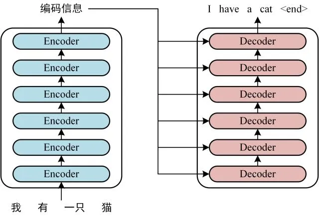

Transformer 的整体结构，左图Encoder和右图Decoder

::: note 可以看 &#x5230;**&#x20;Transformer&#x20;**&#x7531;**&#x20;`Encoder`** &#x548C;**&#x20;`Decoder`&#x20;**&#x4E24;个部分组成，**`Encoder`** &#x548C;**`Decoder`** 都包&#x542B;**&#x20;6 个 `block`。**
:::

* **Transformer&#x20;**&#x7684;工作流程大体如下：

  * **第一步**：获取输入句子的每一个单词的表示**向量 X**，X由单词&#x7684;**` Embedding`**（Embedding就是从原始数据提取出来&#x7684;**`Feature`**） 和单词位置&#x7684;**` Embedding`** 相加得到。

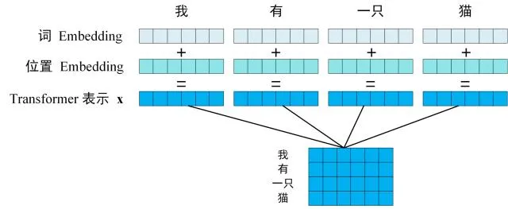

Transformer 的输入表示


Transofrmer Decoder 预测

::: note 上&#x56FE;**&#x20;`Decoder`**&#x63A5;收&#x4E86;**`  Encoder  `**&#x7684;**编码矩阵 C**，然后首先输入一个翻译开始符 **`"<Begin>"`**，预测第一个单词 **`"I"`**；然后输入翻译开始符` `**`"<Begin>"`** 和单&#x8BCD;**` "I"`**，预测单&#x8BCD;**` "have"`**，以此类推。这是 **Transformer** 使用时候的大致流程，接下来是里面各个部分的细节。
:::

## 2. Transformer 的输入

::: note **Transformer** 中单词的输入表&#x793A;**&#x20;x**&#x7531;**`单词 Embedding`** &#x548C;**`位置 Embedding `&#x20;** **（`Positional Encoding`）**&#x76F8;加得到。
:::

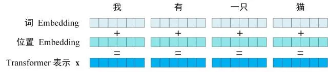

Transformer 的输入表示

### 2.1 单词 `Embedding`


**`单词的 Embedding`&#x20;**&#x6709;很多种方式可以获取，例如可以采用 **Word2Vec**、**Glove&#x20;**&#x7B49;算法预训练得到，也可以在 **Transformer** 中训练得到。

### 2.2  位置 `Embedding`


::: note **`Transformer`** 中除了单词&#x7684;**&#x20;Embedding**，还需要使用位置 Embedding 表示单词出现在句子中的位置。因为 Transformer **`不采用 RNN 的结构`**，而是使用全局信息，不能利用单词的顺序信息，而这部分信息对于 **NLP** 来说非常重要。所以 **Transformer** 中使用位置 **Embedding** 保存单词在序列中的相对或绝对位置。
:::


位置 Embedding &#x7528;**&#x20;PE**表示，**PE** 的维度与单词 **`Embedding`** 是一样的。PE 可以通过训练得到，也可以使用某种公式计算得到。在 Transformer 中采用了后者

**计算公式如下：**

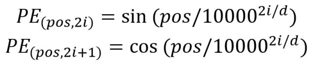

其中，**`pos 表示单词在句子中的位置`**，**`d 表示 PE的维度 (与词 Embedding 一样`)**，**`2i 表示偶数的维度`**，**`2i+1 表示奇数维度 (即 2i≤d, 2i+1≤d)`**。使用这种公式计算 PE 有以下的好处：


::: note 
* &#x4F7F;**&#x20;PE** 能够适应比**训练集**里面所有句子更长的句子，假设训练集里面最长的句子是有 20 个单词，突然来了一个长度为 21 的句子，则使用公式计算的方法可以计算出第 21 位&#x7684;**&#x20;Embedding**。
* **可以让模型容易地计算出相对位置**，对于固定长度的间&#x8DDD;**&#x20;k，PE(pos+k)&#x20;**&#x53EF;以用 **PE(pos)&#x20;**&#x8BA1;算得到。
* 因为 **`Sin(A+B) = Sin(A)Cos(B) + Cos(A)Sin(B), Cos(A+B) = Cos(A)Cos(B) - Sin(A)Sin(B)`**。
:::

## 3. Self-Attention（自注意力机制）

**&#x20;Transformer 的内部结构图**

* 左侧为 **Encoder block**

* 右侧为 **Decoder block**

* 红色圈中的部分为 **`Multi-Head Attention`**，是由多个 **`Self-Attention`**&#x7EC4;成的


1. 可以看到 **Encoder block&#x20;**&#x5305;含一个 `Multi-Head Attention`

2. 而 **Decoder block&#x20;**&#x5305;含两&#x4E2A;**` Multi-Head Attentio`n&#x20;**(其中有一个用到 Masked)。

3. **`Multi-Head Attention`**&#x4E0A;方还包括一&#x4E2A;**&#x20;Add & Norm 层**

4. **Add&#x20;**&#x8868;示残差连&#x63A5;**` (Residual Connection)`** 用于防止网络退化，

5. **Norm** 表示 **`Layer Normalization`**，用于对每一层的激活值进行**归一化**。

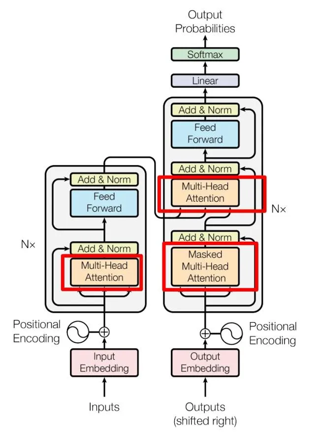

因为 **Self-Attention**是 Transformer 的重点，所以我们重点关注 **`Multi-Head Attention`** 以&#x53CA;**` Self-Attention`**，首先详细了解一&#x4E0B;**`  Self-Attention  `**&#x7684;内部逻辑。

### 3.1 `Self-Attention 结构`

.png)

Self-Attention 结构

上图是 **`Self-Attention`**&#x7684;结构，在计算的时候需要用到矩阵**Q(查询),K(键值)**,**V(值)**。在实际中，Self-Attention 接收的是输入(单词的表示向量x组成的矩阵X) 或者上一个 Encoder block 的输出。而**Q,K,V**正是通过 **`Self-Attention`** 的输入进行**线性变换**得到的。

### 3.2 **`Q, K, V 的计算`**

::: note **`Self-Attention`**&#x7684;输入用**矩阵X**进行表示，则可以使用**线性变阵矩阵WQ**,**WK**,**WV**计算得到**Q**,**K**,**V**。计算如下图所示，注意 X, Q, K, V 的每一行都表示一个单词。
:::

(1).png>)

Q, K, V 的计算


### **实现**

```python
# self-attention 实现
import numpy as np
from math import sqrt
import torch
from torch import nn


class Self_Attention(nn.Module):
    # input : batch_size * seq_len * input_dim
    # q : batch_size * input_dim * dim_k
    # k : batch_size * input_dim * dim_k
    # v : batch_size * input_dim * dim_v
    def __init__(self, input_dim, dim_k, dim_v):
        super(Self_Attention, self).__init__()
        self.q = nn.Linear(input_dim, dim_k)
        self.k = nn.Linear(input_dim, dim_k)
        self.v = nn.Linear(input_dim, dim_v)
        self._norm_fact = 1 / sqrt(dim_k)

    def forward(self, x):
        Q = self.q(x)  # Q: batch_size * seq_len * dim_k
        K = self.k(x)  # K: batch_size * seq_len * dim_k
        V = self.v(x)  # V: batch_size * seq_len * dim_v

        # Q * K.T() # batch_size * seq_len * seq_len
        atten = nn.Softmax(
            dim=-1)(torch.bmm(Q, K.permute(0, 2, 1))) * self._norm_fact

        # Q * K.T() * V # batch_size * seq_len * dim_v
        output = torch.bmm(atten, V)

        return output


X = torch.randn(4, 3, 2)
print(X)
self_atten = Self_Attention(2, 4, 5)  # input_dim:2, k_dim:4, v_dim:5
res = self_atten(X)
print(res.shape)  # [4,3,5]

```

### 3.3 ` Self-Attention 的输出`

得到矩阵 **Q**, **K**, **V**之后就可以计算&#x51FA;**`  Self-Attention  `**&#x7684;输出了，计算的公式如下：

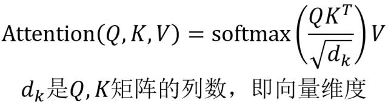

Self-Attention 的输出

::: note 公式中计算矩阵**Q**和**K**每一行向量的内积，为了防止内积过大，因此除以 $$d_k$$的平方根。**Q乘以K**的转置后，得到的矩阵行列数都为 **n**，**n&#x20;**&#x4E3A;句子单词数，这个矩阵可以表示单词之间&#x7684;**&#x20;attention** 强度。下图为Q乘以$$K^{T}$$ ，**1234** 表示的是句子中的单词。
:::


Q乘以K的转置的计算

得到$$QK^{T}$$之后，使用 **Softmax** 计算每一个单词对于其他单词的 **attention** 系数，公式中的 **`Softmax`**&#x662F;对矩阵的每一行进行 **`Softmax`**，即每一行的和都变为 1.


对矩阵的每一行进行 Softmax

得到 **`Softmax`** 矩阵之后可以和V相乘，得到最终的输出Z。

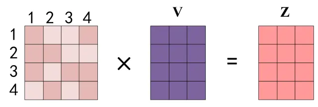

Self-Attention 输出

上图&#x4E2D;**`Softmax`**&#x77E9;阵的第 1 行表示单词 1 与其他所有单词&#x7684;**&#x20;attention&#x20;**&#x7CFB;数，最终单词 1 的输出  $$Z_1$$ 等于所有单词 i 的值 $$V_i$$ 根据 **attention** 系数的比例加在一起得到，如下图所示：

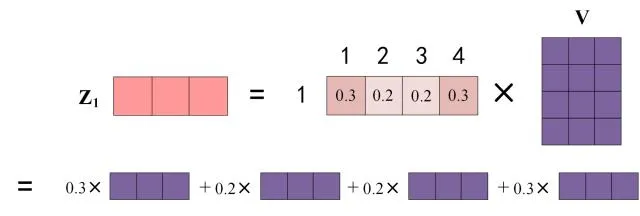

Zi 的计算方法

### 3.4 **`Multi-Head Attention`**

在上一步，我们已经知道怎么通过 **`Self-Attention`计算得到输出矩阵 Z**，而 **`Multi-Head Attention`** 是由多个 Self-Attention 组合形成的，下图是论文中 Multi-Head Attention 的**结构图**。


Multi-Head Attention

从上图可以看到 **`Multi-Head Attention`** 包含多&#x4E2A;**&#x20;Self-Attention** 层，首先将输入**X**分别传递到 **h** 个不同的 Self-Attention 中，计算得到 **h&#x20;**&#x4E2A;输出矩阵**Z**。下图&#x662F;**&#x20;h=8&#x20;**&#x65F6;候的情况，此时会得到 8 个输出**矩阵Z**。

### 实现

```python
#%%
# Muti-head Attention 机制的实现
from math import sqrt
import torch
import torch.nn as nn


class Self_Attention_Muti_Head(nn.Module):
    # input : batch_size * seq_len * input_dim
    # q : batch_size * input_dim * dim_k
    # k : batch_size * input_dim * dim_k
    # v : batch_size * input_dim * dim_v
    def __init__(self,input_dim,dim_k,dim_v,nums_head):
        super(Self_Attention_Muti_Head,self).__init__()
        assert dim_k % nums_head == 0
        assert dim_v % nums_head == 0
        self.q = nn.Linear(input_dim,dim_k)
        self.k = nn.Linear(input_dim,dim_k)
        self.v = nn.Linear(input_dim,dim_v)
        
        self.nums_head = nums_head
        self.dim_k = dim_k
        self.dim_v = dim_v
        self._norm_fact = 1 / sqrt(dim_k)
        
    
    def forward(self,x):
        Q = self.q(x).reshape(-1,x.shape[0],x.shape[1],self.dim_k // self.nums_head) 
        K = self.k(x).reshape(-1,x.shape[0],x.shape[1],self.dim_k // self.nums_head) 
        V = self.v(x).reshape(-1,x.shape[0],x.shape[1],self.dim_v // self.nums_head)
        print(x.shape)
        print(Q.size())

        atten = nn.Softmax(dim=-1)(torch.matmul(Q,K.permute(0,1,3,2))) # Q * K.T() # batch_size * seq_len * seq_len
        
        output = torch.matmul(atten,V).reshape(x.shape[0],x.shape[1],-1) # Q * K.T() * V # batch_size * seq_len * dim_v
        
        return output
    
x=torch.rand(1,3,4)
print(x)
# %%
atten=Self_Attention_Muti_Head(4,4,4,2)
y=atten(x)
print(y.shape)

# %%

```


多个 Self-Attention

得到 **8 个输出矩阵**  $$Z_1$$ 到  $$Z_8$$之后，**`Multi-Head Attention`&#x20;**&#x5C06;它们拼接在一&#x8D77;**&#x20;(Concat)**，然后传入一个**Linear**层，得到 Multi-Head Attention 最终的输出Z。

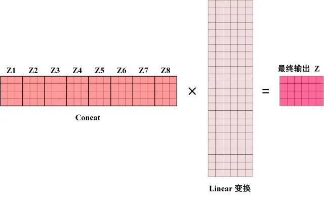

Multi-Head Attention 的输出

可以看到 **`Multi-Head Attention`** 输出的**矩阵Z**与其输入的**矩阵X**的维度是一样的。

## 4. Encoder 结构

**红色部分**是 Transformer &#x7684;**` Encoder block`** 结构，可以看到是由 **`Multi-Head Attention`**, **`Add & Norm`**, **`Feed Forward`**, **Add & Norm** 组成的。刚刚已经了解了 Multi-Head Attention 的计算过程，现在了解一下 Add & Norm 和 Feed Forward 部分。

.png)

Transformer Encoder block


### 4.1  Add & Norm

**Add & Norm&#x20;**&#x5C42;由 Add 和 Norm 两部分组成，其计算公式如下：


Add \&amp;amp;amp;amp; Norm 公式

其&#x4E2D;**&#x20;X**表示 **`Multi-Head Attention`**` `或者 **Feed Forward** 的输入，**`MultiHeadAttention(X`**) 和 **`FeedForward(X) `**&#x8868;示输出 (输出与输&#x5165;**&#x20;X&#x20;**&#x7EF4;度是一样的，所以可以相加)


**Add**指 X+MultiHeadAttention(X)，是一种残差连接，通常用于解决**多层网络训练**的问题，可以让网络只关注当前差异的部分，在 **ResNe**t 中经常用到：


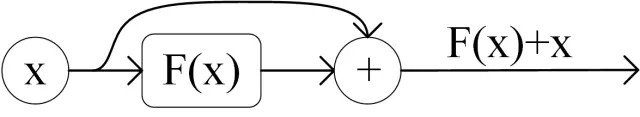

残差连接

**Norm**指 **`Layer Normalization`**，通常用于 **RNN** 结构，**`Layer Normalization`** 会将每一层**神经元**的输入都转成**均值方差**都一样的，这样可以加快**收敛**。

### 4.2  Feed Forward

**Feed Forward&#x20;**&#x5C42;比较简单，是一个两层的**全连接层**，第一层的**激活函数**&#x4E3A;**` Relu`**，第二层不使用激活函数，对应的公式如下。


Feed Forward

**X**是输入，**`Feed Forward `**&#x6700;终得到的输出矩阵的维度与X一致。

### 4.3 组成 Encoder

::: note 通过上面描述&#x7684;**` Multi-Head Attention`,` Feed Forward`**`,`**` Add & Norm`** 就可以构造出一个 **Encoder block**，**Encoder block&#x20;**&#x63A5;收输入矩阵 $$X_{(n\times d)}$$ ，并输出一个矩阵$$O_{(n\times d)}$$ 。通过多个 Encoder block 叠加就可以组成 Encoder。
:::


* 第一个 **`Encoder block `**&#x7684;输入为句子单词的表示**向量矩阵**，


* 后&#x7EED;**&#x20;`Encoder block`** 的输入是前一个 Encoder block 的**输出**


* 最后一个 **`Encoder block`** 输出的矩阵就是**编码信息矩阵 C**，这一矩阵后续会用&#x5230;**&#x20;Decoder** 中。


## 5. Decoder 结构

**红色部分**为 **Transformer** &#x7684;**&#x20;Decoder block&#x20;**&#x7ED3;构，与 Encoder block 相似，但是存在一些区别：


* 包含两&#x4E2A;**` Multi-Head Attention`** 层。


* 第一个 **`Multi-Head Attention`** 层采用了 **Masked** 操作。


* 第二&#x4E2A;**&#x20;`Multi-Head Attention`** 层的**K**, **V**矩阵使用 **Encoder** 的编码信息矩阵C进行计算，而Q使用上一个 **Decoder block** 的输出计算。


* 最后有一个 **`Softmax`** 层计算下一个翻译单词的概率。


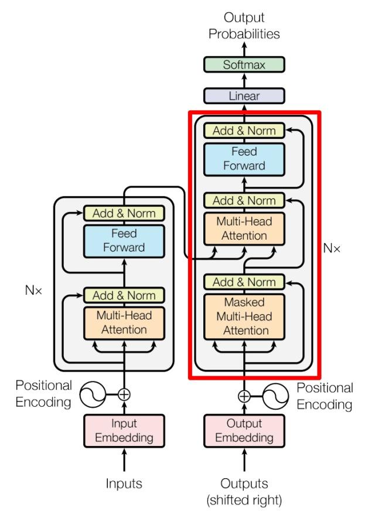

Transformer Decoder block

### 5.1 `第一个 Multi-Head Attention`

::: note **`Decoder block`** 的第一个 Multi-Head Attention 采用了 Masked 操作，因为在翻译的过程中是顺序翻译的，即翻译完第 i 个单词，才可以翻译第 i+1 个单词。通过 Masked 操作可以防止第 i 个单词知道 i+1 个单词之后的信息。下面以 "我有一只猫" 翻译成 "I have a cat" 为例，了解一下 Masked 操作。
:::


* &#x5728;**&#x20;Decoder** 的时候，是需要根据之前的翻译，求解当前最有可能的翻译，如下图所示。首先根据输入 "\<Begin>" 预测出第一个单词&#x4E3A;**&#x20;"I"**，然后根据输&#x5165;**` "<Begin> I`"** 预测下一个单词 **"`have"`。**

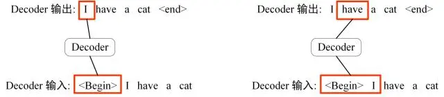

Decoder 预测

* **Decoder&#x20;**&#x53EF;以在训练的过程中使用 **`Teacher Forcing`** 并且**并行化训练**，即将正确的单词序&#x5217;**`  (<Begin> I have a cat)  `**&#x548C;对应输&#x51FA;**` (I have a cat <end>)`&#x20;**&#x4F20;递&#x5230;**&#x20;Decoder**。那么在预测第 **`i `**&#x4E2A;输出时，就要将&#x7B2C;**` i+1`** 之后的单词掩盖住，

* 注意 **Mask** 操作是在 **`Self-Attention`** &#x7684;**` Softmax`&#x20;**&#x4E4B;前使用的，下面用 0 1 2 3 4 5 分别表&#x793A;**` <Begin> I have a cat <end>`**。

**第一步**：

::: note 1. 是 Decoder 的输入矩阵和 Mask 矩阵，输入矩阵包含 "\<Begin> I have a cat" (0, 1, 2, 3, 4) 五个单词的表示向量，Mask 是一个 5×5 的矩阵。在 Mask 可以发现单词 0 只能使用单词 0 的信息，而单词 1 可以使用单词 0, 1 的信息，即只能使用之前的信息。
:::

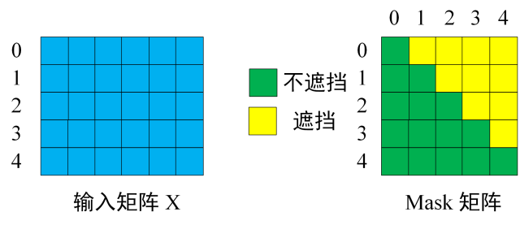

输入矩阵与 Mask 矩阵

**第二步**：

::: note 2. '接下来的操作和之前的 Self-Attention 一样，通过输入矩阵X计算得到Q,K,V矩阵。然后计算Q和 $$K^T\text{ 的乘积 }QK^T$$
:::

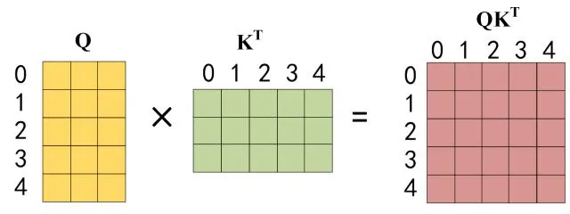

Q乘以K的转置

**第三步**：

::: note 3. 在得到 $$QK^{T}$$之后需要进行 Softmax，计算 attention score，我们在 Softmax 之前需要使用Mask矩阵遮挡住每一个单词之后的信息，遮挡操作如下：
:::

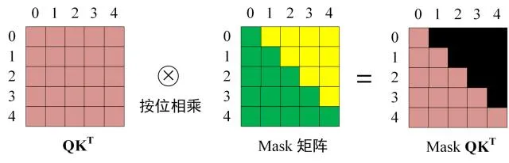

Softmax 之前 Mask

得到 Mask $$QK^{T}$$ 之后在 Mask $$QK^{T}$$上进行 Softmax，每一行的和都为 1。但是单词 0 在单词 1, 2, 3, 4 上的 attention score 都为 0。

**第四步**：

::: note 4. 使用 Mask  $$QK^{T}$$与矩阵 V相乘，得到输出 Z，则单词 1 的输出向量  $$Z_1$$ 是只包含单词 1 信息的。
:::

**第五步**：

::: note 5. 通过上述步骤就可以得到一个 Mask Self-Attention 的输出矩阵  $$Z_i$$ ，然后和 Encoder 类似，通过 Multi-Head Attention 拼接多个输出$$Z_i$$ 然后计算得到第一个 Multi-Head Attention 的输出Z，Z与输入X维度一样。
:::

### 5.2 ` 第二个 Multi-Head Attention`

* **`Decoder block`** 第二个 **`Multi-Head Attention`** 变化不大， 主要的区别在于其中 **`Self-Attention `**&#x7684; **K**, **V**矩阵不是使用 上一&#x4E2A;**&#x20;`Decoder block`** 的输出计算的，而是使&#x7528;**&#x20;Encoder** 的编码信息矩阵 C 计算的。

* 根据 **Encoder** 的输出 **C**计算得到 **K**, **V**，根据上一&#x4E2A;**` Decoder block`** 的输&#x51FA;**&#x20;Z&#x20;**&#x8BA1;算 **Q&#x20;**(如果是第一&#x4E2A;**&#x20;`Decoder block`**` `则使用输入**矩阵 X** 进行计算)，后续的计算方法与之前描述的一致。

* 这样做的好处是在 **Decoder&#x20;**&#x7684;时候，每一位单词都可以利用到 Encoder 所有单词的信息 (这些信息无需 **Mask**)。

### 5.3 **`Softmax`**&#x9884;测输出单词

**Decoder block&#x20;**&#x6700;后的部分是利用 **`Softmax`** 预测下一个单词，在之前的**网络层**我们可以得到一个最终的输出 Z，因为 **Mask** 的存在，使得单词 **`0`&#x20;**&#x7684;输出 **`Z0`** 只包含单词 **`0`&#x20;**&#x7684;信息，如下：

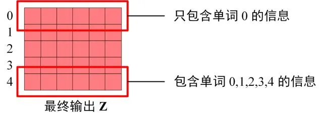

Decoder Softmax 之前的 Z

**`Softmax`** 根据输出矩阵的每一行预测下一个单词：

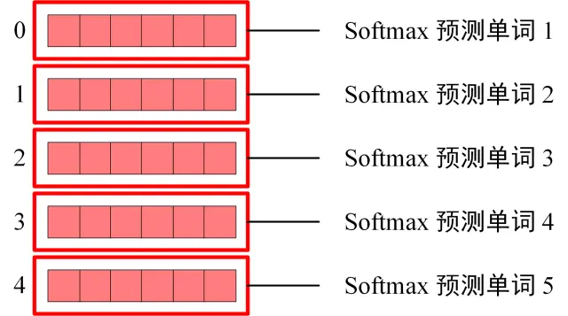

Decoder Softmax 预测

这就是 **`Decoder block`** 的定义，&#x4E0E;**&#x20;`Encoder`&#x20;**&#x4E00;样，**`Decoder`** 是由多&#x4E2A;**` Decoder block`** 组合而成。

## 6. Transformer 总结

::: tip
* Transformer 与 RNN 不同，可以比较好地并行训练。
* Transformer 本身是不能利用单词的顺序信息的，因此需要在输入中添加位置 Embedding，否则 Transformer 就是一个词袋模型了。
* Transformer 的重点是 Self-Attention 结构，其中用到的 Q, K, V矩阵通过输出进行线性变换得到。
* Transformer 中 Multi-Head Attention 中有多个 Self-Attention，可以捕获单词之间多种维度上的相关系数 attention score。
:::
