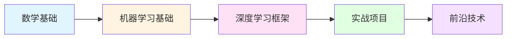

## 📘 AI 人工智能简介

人工智能（Artificial Intelligence, AI）是计算机科学的一个分支，致力于创建能够模拟人类智能行为的系统。随着深度学习、大语言模型等技术的发展，AI 已经在图像识别、自然语言处理、推荐系统等领域取得了显著成果。

本专栏主要收录 AI 相关的理论知识、模型架构、实践应用等内容，帮助您了解和掌握人工智能技术。

### 🎯 核心应用领域

- 🤖 **自然语言处理（NLP）**: 文本生成、机器翻译、情感分析
- 👁️ **计算机视觉（CV）**: 图像识别、目标检测、图像生成
- 🎵 **语音技术**: 语音识别、语音合成、声纹识别
- 🎮 **强化学习**: 游戏AI、机器人控制、自动驾驶
- 💡 **推荐系统**: 个性化推荐、内容分发

---

## 🚀 快速开始

### 学习路径建议



### Python 环境准备

```bash
# 安装常用 AI 框架
pip install torch torchvision  # PyTorch
pip install tensorflow         # TensorFlow
pip install transformers       # HuggingFace Transformers
pip install openai            # OpenAI API
```

### 简单示例：使用 Transformer

```python
from transformers import pipeline

# 加载预训练模型
classifier = pipeline("sentiment-analysis")

# 情感分析
result = classifier("I love learning AI!")
print(result)
# [{'label': 'POSITIVE', 'score': 0.9998}]
```

---

## 📚 文档目录

本站收录的 AI 相关文档包括：

### 🎓 基础理论
- [逐层分解 Transformer](./1.逐层分解Transformer.md) - 深入理解 Transformer 架构的每个组件

### 🔬 模型架构
> 持续更新中...

### 💼 实战应用
> 持续更新中...

### 📖 论文解读
> 持续更新中...

---

## 🌟 热门技术栈

<CardGrid>
  <Card title="大语言模型" icon="🤖">
    - GPT 系列
    - Claude
    - LLaMA
    - Gemini
  </Card>
  
  <Card title="AI 框架" icon="🔧">
    - PyTorch
    - TensorFlow
    - JAX
    - MXNet
  </Card>
  
  <Card title="训练工具" icon="⚙️">
    - Transformers
    - LangChain
    - LlamaIndex
    - vLLM
  </Card>
  
  <Card title="应用场景" icon="💡">
    - ChatBot
    - 图像生成
    - 代码助手
    - 内容创作
  </Card>
</CardGrid>

---

## 🔗 学习资源

### 官方资源
- [OpenAI 官网](https://openai.com/) - ChatGPT 背后的公司
- [Hugging Face](https://huggingface.co/) - AI 模型和数据集平台
- [PyTorch 官方文档](https://pytorch.org/docs/) - 深度学习框架文档
- [TensorFlow 官方文档](https://www.tensorflow.org/) - Google 深度学习框架

### 经典课程
- [吴恩达深度学习课程](https://www.coursera.org/specializations/deep-learning)
- [CS231n: 计算机视觉](http://cs231n.stanford.edu/)
- [CS224n: 自然语言处理](http://web.stanford.edu/class/cs224n/)

### 推荐阅读
- [Attention Is All You Need](https://arxiv.org/abs/1706.03762) - Transformer 开山之作
- [BERT 论文](https://arxiv.org/abs/1810.04805) - 预训练语言模型
- [GPT-3 论文](https://arxiv.org/abs/2005.14165) - 大语言模型

### 中文社区
- [机器之心](https://www.jiqizhixin.com/)
- [AI 科技大本营](https://blog.csdn.net/dQCFKyQDXYm3F8rB0/)
- [量子位](https://www.qbitai.com/)

---

## 📊 AI 技术发展

### 重要里程碑

| 年份 | 事件 | 影响 |
|------|------|------|
| 2012 | AlexNet 在 ImageNet 获胜 | 开启深度学习时代 |
| 2017 | Transformer 论文发表 | 革新 NLP 领域 |
| 2018 | BERT 发布 | 预训练模型成为主流 |
| 2020 | GPT-3 发布 | 大模型展现惊人能力 |
| 2022 | ChatGPT 发布 | AI 应用走向大众 |
| 2023 | GPT-4 & Claude 3 | 多模态大模型时代 |

---

## ❓ 常见问题

### Q: 学习 AI 需要什么数学基础？
A: 主要需要：
- **线性代数**: 矩阵运算、特征值分解
- **微积分**: 导数、梯度、反向传播
- **概率统计**: 概率分布、贝叶斯定理
- **优化理论**: 梯度下降、优化算法

### Q: PyTorch 和 TensorFlow 该选哪个？
A: 
- **PyTorch**: 更加 Pythonic，研究和原型开发友好，生态丰富
- **TensorFlow**: 生产部署成熟，移动端支持好
- **建议**: 初学者推荐 PyTorch，企业生产可考虑 TensorFlow

### Q: 如何跟上 AI 的快速发展？
A: 
- 订阅顶会论文（NeurIPS, ICML, ACL等）
- 关注 Hugging Face、OpenAI 等平台动态
- 参与开源项目和社区讨论
- 动手实践，保持学习

---

## 💡 学习建议

> **循序渐进**: 从基础的机器学习开始，再深入深度学习和大模型
> 
> **动手实践**: 理论结合实践，多做项目多写代码
> 
> **保持好奇**: AI 发展迅速，保持学习热情和好奇心
> 
> **关注应用**: 思考如何将 AI 技术应用到实际问题中

---

## 📝 最近更新

<CardGrid>
  <Card title="📊 统计" icon="openmoji:bar-chart">
    本站收录了 <strong>14 篇</strong> AI 相关文档<br/>
    <small>最后更新: <CustomDateTime /></small>
  </Card>
  
  <Card title="🎯 学习目标" icon="openmoji:target">
    掌握 AI 核心概念<br/>
    了解主流模型架构<br/>
    具备实战应用能力
  </Card>
</CardGrid>

<br/>

<Yiyan />