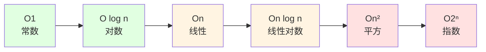
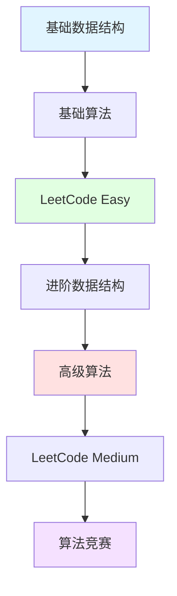

## 📘 数据结构与算法简介

数据结构与算法是计算机科学的核心基础，也是每个程序员的必修课。掌握数据结构与算法，不仅能帮助你写出高效的代码，还是通过技术面试的关键。

本专栏系统地介绍常见的数据结构（数组、链表、树、图等）和算法（排序、查找、动态规划等），并提供大量的实战题目和解题技巧。

### 🎯 学习目标

- 📊 **理解核心数据结构**: 数组、链表、栈、队列、树、图、哈希表
- 🧮 **掌握常用算法**: 排序、查找、递归、动态规划、贪心
- 💡 **提升问题解决能力**: 分析时间/空间复杂度
- 🎓 **应对技术面试**: LeetCode、剑指 Offer 等经典题目
- 🚀 **优化代码性能**: 选择合适的数据结构和算法

---

## 📚 知识体系

### 数据结构

<CardGrid>
  <Card title="线性结构" icon="📏">
    - 数组 (Array)<br/>
    - 链表 (Linked List)<br/>
    - 栈 (Stack)<br/>
    - 队列 (Queue)
  </Card>
  
  <Card title="树形结构" icon="🌳">
    - 二叉树<br/>
    - 二叉搜索树<br/>
    - 平衡树 (AVL, 红黑树)<br/>
    - 堆 (Heap)
  </Card>
  
  <Card title="图结构" icon="🕸️">
    - 有向图/无向图<br/>
    - 加权图<br/>
    - 最短路径<br/>
    - 拓扑排序
  </Card>
  
  <Card title="其他结构" icon="🔧">
    - 哈希表 (Hash Table)<br/>
    - 字典树 (Trie)<br/>
    - 并查集<br/>
    - 布隆过滤器
  </Card>
</CardGrid>

### 算法分类

| 类型 | 常见算法 | 应用场景 |
|------|---------|---------|
| **排序** | 快速、归并、堆排序 | 数据排序 |
| **查找** | 二分、哈希、BFS/DFS | 数据检索 |
| **动态规划** | 背包、最长子序列 | 优化问题 |
| **贪心** | 区间调度、霍夫曼编码 | 局部最优 |
| **分治** | 归并排序、快速幂 | 分而治之 |
| **回溯** | 全排列、N皇后 | 穷举搜索 |

---

## 📊 复杂度分析

### 时间复杂度



### 常见复杂度对比

- **O(1)**: 哈希表查找、数组随机访问
- **O(log n)**: 二分查找、平衡树操作
- **O(n)**: 遍历数组、链表
- **O(n log n)**: 快速排序、归并排序
- **O(n²)**: 冒泡排序、两层循环
- **O(2ⁿ)**: 递归斐波那契、子集生成

---

## 🔗 学习资源

### 在线平台
- [LeetCode](https://leetcode.cn/) - 算法题库
- [牛客网](https://www.nowcoder.com/) - 面试刷题
- [HackerRank](https://www.hackerrank.com/) - 编程挑战
- [Codeforces](https://codeforces.com/) - 算法竞赛

### 推荐书籍
- 《算法导论》(CLRS) - 经典教材
- 《算法》(第4版) - Sedgewick
- 《剑指 Offer》- 面试必备
- 《编程珠玑》- 思维训练

### 视频教程
- [算法可视化](https://visualgo.net/) - 动画演示
- [数据结构可视化](https://www.cs.usfca.edu/~galles/visualization/)

---

## ❓ 常见问题

### Q: 如何学习数据结构与算法？
A:
1. **理解基础**: 先掌握基本概念和原理
2. **动手实现**: 用代码实现每种数据结构
3. **刷题练习**: LeetCode 按类型刷题
4. **总结归纳**: 整理常见题型和解法
5. **持续复习**: 定期回顾和复习

### Q: 需要刷多少题才够？
A:
- **入门**: 100-200 题基础题
- **进阶**: 300-500 题中等题
- **高级**: 800+ 题包含困难题
- **关键**: 质量>数量，理解>记忆

### Q: 时间复杂度如何计算？
A:
```python
# O(1) - 常数时间
arr[0] = 1

# O(n) - 线性时间
for i in range(n):
    print(i)

# O(n²) - 平方时间
for i in range(n):
    for j in range(n):
        print(i, j)

# O(log n) - 对数时间
while n > 1:
    n = n // 2
```

---

## 💡 刷题技巧

### 解题思路

1. **理解题意**: 仔细审题，明确输入输出
2. **举例分析**: 用具体例子理解问题
3. **暴力求解**: 先想出能work的解法
4. **优化思路**: 分析时间/空间复杂度
5. **编码实现**: 写出清晰的代码
6. **测试验证**: 考虑边界情况

### 常见模式

- **双指针**: 数组/链表问题
- **滑动窗口**: 子数组/子串问题
- **二分查找**: 有序数组查找
- **BFS/DFS**: 树/图遍历
- **动态规划**: 优化问题
- **回溯**: 组合/排列问题

---

## 📈 学习路线



---

## 📝 最近更新

<CardGrid>
  <Card title="📊 文档统计" icon="📈">
    本站收录了 <strong>4 篇</strong> 算法相关文档<br/>
    持续更新中...<br/>
    <small>最后更新: <CustomDateTime /></small>
  </Card>
  
  <Card title="🎯 学习建议" icon="🎓">
    <strong>基础</strong>: 数组、链表、栈、队列<br/>
    <strong>进阶</strong>: 树、图、动态规划<br/>
    <strong>实战</strong>: LeetCode 刷题
  </Card>
</CardGrid>

<br/>

<Yiyan />
