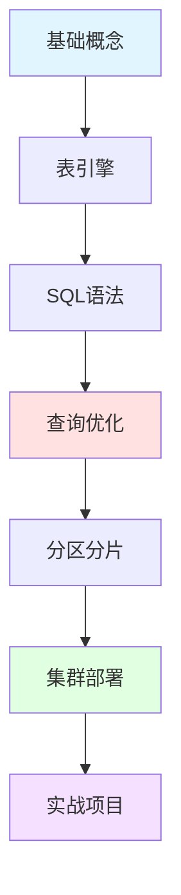

## 📘 ClickHouse 简介

ClickHouse 是一款开源的列式数据库管理系统（DBMS），由俄罗斯 Yandex 公司开发，专门用于在线分析处理（OLAP）。ClickHouse 以其极高的查询性能、优秀的压缩率和水平扩展能力而著称，特别适合处理大规模数据的实时分析场景。

ClickHouse 可以在单台服务器上每秒处理数十亿行数据的查询，是大数据分析和实时BI的理想选择。

### ✨ 核心特性

- ⚡ **极致性能**: 列式存储，查询速度极快
- 📊 **OLAP优化**: 专为分析查询设计，支持复杂聚合
- 💾 **高压缩率**: 数据压缩比可达 10:1 甚至更高
- 🚀 **线性扩展**: 支持水平扩展，轻松应对PB级数据
- 🔧 **SQL兼容**: 支持标准 SQL，学习成本低
- 📦 **丰富引擎**: MergeTree、ReplacingMergeTree等多种表引擎
- 🌐 **分布式**: 原生支持分布式查询

---

## 🚀 快速开始

### 安装 ClickHouse

```bash
# Ubuntu/Debian
sudo apt-get install -y apt-transport-https ca-certificates dirmngr
sudo apt-key adv --keyserver hkp://keyserver.ubuntu.com:80 --recv 8919F6BD2B48D754
echo "deb https://packages.clickhouse.com/deb stable main" | sudo tee /etc/apt/sources.list.d/clickhouse.list
sudo apt-get update
sudo apt-get install -y clickhouse-server clickhouse-client

# Docker
docker run -d --name clickhouse-server --ulimit nofile=262144:262144 -p 8123:8123 -p 9000:9000 clickhouse/clickhouse-server

# macOS (Homebrew)
brew install clickhouse
```

### 连接 ClickHouse

```bash
# 命令行客户端
clickhouse-client

# 或指定主机
clickhouse-client --host localhost --port 9000
```

### 基础操作

```sql
-- 创建数据库
CREATE DATABASE analytics;

-- 使用数据库
USE analytics;

-- 创建表 (MergeTree 引擎)
CREATE TABLE events (
    event_time DateTime,
    user_id UInt32,
    event_type String,
    value Float64
) ENGINE = MergeTree()
ORDER BY (event_time, user_id);

-- 插入数据
INSERT INTO events VALUES
    ('2024-01-01 10:00:00', 001, 'click', 1.5),
    ('2024-01-01 10:05:00', 102, 'view', 2.3);

-- 查询数据
SELECT 
    toDate(event_time) as date,
    event_type,
    count() as cnt,
    avg(value) as avg_value
FROM events
WHERE event_time >= '2024-01-01'
GROUP BY date, event_type
ORDER BY date DESC;
```

---

## 📚 文档目录

本站收录的 ClickHouse 相关文档包含文章，涵盖：

### 🎓 基础知识
- ClickHouse 架构原理
- 列式存储优势
- 表引擎详解
- 数据类型选择

### 🔧 进阶主题
- 分区与分片
- 物化视图应用
- 查询优化技巧
- 集群部署方案

### 💼 实战应用
- 日志分析系统
- 实时数据仓库
- 用户行为分析
- 指标监控平台

---

## 🌟 ClickHouse 优势

<CardGrid>
  <Card title="性能卓越" icon="⚡">
    - 列式存储引擎
    - 向量化执行
    - 数据压缩优化
    - 并行处理
  </Card>
  
  <Card title="适用场景" icon="📊">
    - 日志分析
    - 实时BI
    - 用户画像
    - 时序数据
  </Card>
  
  <Card title="集成生态" icon="🔌">
    - Kafka 集成
    - Grafana 可视化
    - Prometheus 监控
    - DataGrip 管理
  </Card>
  
  <Card title="成本优势" icon="💰">
    - 开源免费
    - 高压缩率
    - 硬件要求低
    - 运维简单
  </Card>
</CardGrid>

---

## 🔗 学习资源

### 官方资源
- [ClickHouse 官网](https://clickhouse.com/) - 官方网站
- [官方文档](https://clickhouse.com/docs/) - 完整文档
- [ClickHouse GitHub](https://github.com/ClickHouse/ClickHouse) - 源代码

### 推荐阅读
- [ClickHouse 中文社区](https://clickhouse.com.cn/)
- [ClickHouse 实战教程](https://clickhouse.com/docs/zh/)
- [高性能分析案例](https://clickhouse.com/docs/zh/guides/)

---

## 📊 与其他数据库对比

| 特性 | ClickHouse | MySQL | PostgreSQL |
|------|-----------|-------|-----------|
| **查询性能** | ⭐⭐⭐⭐⭐ | ⭐⭐⭐ | ⭐⭐⭐ |
| **压缩率** | ⭐⭐⭐⭐⭐ | ⭐⭐ | ⭐⭐⭐ |
| **写入速度** | ⭐⭐⭐⭐ | ⭐⭐⭐⭐⭐ | ⭐⭐⭐⭐ |
| **OLAP能力** | ⭐⭐⭐⭐⭐ | ⭐⭐ | ⭐⭐⭐ |
| **事务支持** | ⭐⭐ | ⭐⭐⭐⭐⭐ | ⭐⭐⭐⭐⭐ |

> 💡 **定位**: ClickHouse 专注 OLAP，MySQL/PostgreSQL 更适合 OLTP

---

## ❓ 常见问题

### Q: ClickHouse 适合什么场景？
A: 
- ✅ 日志分析、用户行为分析
- ✅ 实时数据仓库、BI报表
- ✅ 时序数据、监控指标
- ❌ 高频更新、事务处理

### Q: ClickHouse 的性能为什么这么快？
A:
1. **列式存储**: 只读取需要的列
2. **向量化执行**: SIMD 指令加速
3. **数据压缩**: 减少I/O
4. **并行处理**: 充分利用多核

### Q: 如何选择表引擎？
A:
- **MergeTree**: 默认选择，适合大部分场景
- **ReplacingMergeTree**: 自动去重
- **SummingMergeTree**: 自动聚合
- **DistributedMergeTree**: 分布式表

---

## 💡 最佳实践

> **合理分区**: 按时间分区，加速查询和删除
> 
> **选对索引**: 主键要按查询模式设计
> 
> **批量写入**: 避免单条插入，使用批量导入
> 
> **物化视图**: 预计算复杂聚合，加速查询
> 
> **监控调优**: 关注查询慢日志，持续优化

---

## 📈 学习路线



---

## 📝 最近更新

<CardGrid>
  <Card title="📊 文档统计" icon="📈">
    本站收录了 ClickHouse 相关文档<br/>
    持续更新中...<br/>
    <small>最后更新: <CustomDateTime /></small>
  </Card>
  
  <Card title="🎯 学习建议" icon="🎓">
    <strong>入门</strong>: 了解列式存储原理<br/>
    <strong>进阶</strong>: 掌握表引擎选择<br/>
    <strong>实战</strong>: 构建分析系统
  </Card>
</CardGrid>

<br/>

<Yiyan />