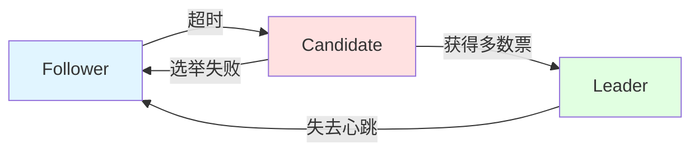
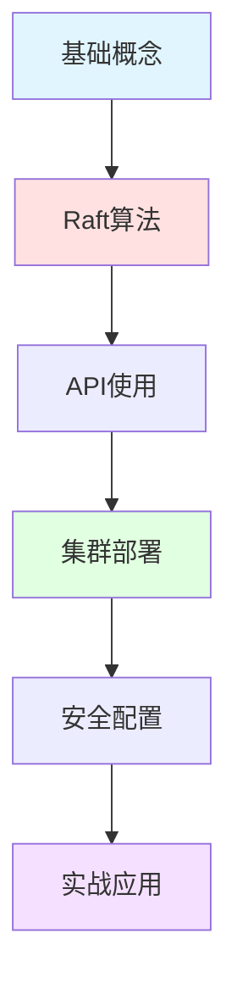

## 📘 Etcd 简介

Etcd 是一个高可用的分布式键值存储系统，由 CoreOS 开发，现由 CNCF（云原生计算基金会）托管。Etcd 主要用于共享配置和服务发现，它提供了可靠的数据持久化、watch机制和分布式锁等特性。

Etcd 被广泛应用于 Kubernetes、服务网格等云原生技术栈中，是云原生生态的重要基础设施组件。

### ✨ 核心特性

- 🔐 **强一致性**: 基于 Raft 协议保证数据一致性
- 🚀 **高可用**: 支持集群部署，自动故障转移
- 👀 **Watch机制**: 实时监听键值变化
- 🔒 **分布式锁**: 原生支持分布式事务和锁
- 📜 **历史版本**: 支持多版本并发控制（MVCC）
- 🌐 **HTTP/gRPC**: 提供 RESTful 和 gRPC 接口
- 🛡️ **安全机制**: 支持 TLS、RBAC 权限控制

---

## 🚀 快速开始

### 安装 Etcd

```bash
# macOS
brew install etcd

# Linux - 下载二进制
ETCD_VER=v3.5.9
wget https://github.com/etcd-io/etcd/releases/download/${ETCD_VER}/etcd-${ETCD_VER}-linux-amd64.tar.gz
tar xzvf etcd-${ETCD_VER}-linux-amd64.tar.gz
cd etcd-${ETCD_VER}-linux-amd64
sudo cp etcd etcdctl /usr/local/bin/

# Docker
docker run -d --name etcd -p 2379:2379 -p 2380:2380 \
  quay.io/coreos/etcd:latest \
  /usr/local/bin/etcd \
  --advertise-client-urls http://0.0.0.0:2379 \
  --listen-client-urls http://0.0.0.0:2379
```

### 基本操作

```bash
# 写入键值
etcdctl put mykey "hello etcd"

# 读取键值
etcdctl get mykey

# 删除键
etcdctl del mykey

# 监听键变化
etcdctl watch mykey

# 设置带TTL的键
etcdctl put mykey "value" --lease=`etcdctl lease grant 60 | awk '{print $2}'`

# 查看集群成员
etcdctl member list

# 查看集群健康状态
etcdctl endpoint health
```

---

## 📚 文档目录

本站收录的 Etcd 相关文档，涵盖：

### 🎓 基础知识
- Etcd 架构原理
- Raft 共识算法
- 数据模型与API
- Watch 机制详解

### 🔧 进阶主题
- 集群部署与管理
- 数据备份与恢复
- 性能调优
- 安全配置（TLS、RBAC）

### 💼 实战应用
- 服务发现
- 配置中心
- 分布式锁实现
- Kubernetes 集成

---

## 🌟 Etcd 应用场景

<CardGrid>
  <Card title="服务发现" icon="🔍">
    - 动态服务注册
    - 健康检查
    - 负载均衡
    - 服务路由
  </Card>
  
  <Card title="配置管理" icon="⚙️">
    - 集中配置存储
    - 配置热更新
    - 多环境管理
    - 配置版本控制
  </Card>
  
  <Card title="分布式协调" icon="🔗">
    - 分布式锁
    - Leader 选举
    - 分布式队列
    - 屏障机制
  </Card>
  
  <Card title="Kubernetes" icon="☸️">
    - 集群状态存储
    - 配置数据
    - Secret 管理
    - 服务发现
  </Card>
</CardGrid>

---

## 🔗 学习资源

### 官方资源
- [Etcd 官网](https://etcd.io/) - 官方网站
- [官方文档](https://etcd.io/docs/) - 完整文档
- [Etcd GitHub](https://github.com/etcd-io/etcd) - 源代码
- [Raft 论文](https://raft.github.io/) - Raft 算法

### 推荐阅读
- [Etcd 实战教程](https://etcd.io/docs/latest/tutorials/)
- [Kubernetes 与 Etcd](https://kubernetes.io/docs/tasks/administer-cluster/configure-upgrade-etcd/)
- [分布式一致性算法](https://raft.github.io/raft.pdf)

---

## 📊 架构原理

### Raft 共识算法



### 集群架构

- **Leader**: 处理所有写请求，同步数据到 Follower
- **Follower**: 处理读请求，转发写请求给 Leader
- **Candidate**: 选举期间的临时状态

---

## ❓ 常见问题

### Q: Etcd 和 ZooKeeper 有什么区别？
A:
| 特性 | Etcd | ZooKeeper |
|------|------|-----------|
| 一致性算法 | Raft | ZAB |
| API | HTTP/gRPC | 自定义协议 |
| 数据模型 | Key-Value | 树形结构 |
| 社区 | CNCF | Apache |
| 使用难度 | 简单 | 较复杂 |

### Q: Etcd 集群需要多少节点？
A: 
- **最少 3 个节点**（容忍1个故障）
- **推荐 5 个节点**（容忍2个故障）
- 必须是奇数个节点（2n+1）

### Q: 如何保证数据安全？
A:
- 启用 TLS 加密通信
- 配置 RBAC 权限控制
- 定期备份数据
- 监控集群健康状态

---

## 💡 最佳实践

> **集群规模**: 3-5个节点为佳，不要过大
> 
> **数据大小**: 单个键值不超过1MB
> 
> **读写分离**: Leader处理写，Follower处理读
> 
> **定期备份**: 使用快照备份重要数据
> 
> **监控告警**: 监控延迟、leader变更等指标

---

## 📈 学习路线



---

## 📝 最近更新

<CardGrid>
  <Card title="📊 特点" icon="⭐">
    高可用、强一致性的分布式KV存储<br/>
    Kubernetes 核心组件<br/>
    <small>最后更新: <CustomDateTime /></small>
  </Card>
  
  <Card title="🎯 学习重点" icon="🎓">
    <strong>基础</strong>: Raft 算法和基本操作<br/>
    <strong>进阶</strong>: 集群部署和调优<br/>
    <strong>实战</strong>: 服务发现和配置中心
  </Card>
</CardGrid>

<br/>

<Yiyan />
