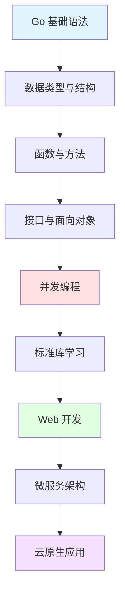

## 📘 Go 语言简介

Go（又称 Golang）是 Google 开发的一种静态强类型、编译型、并发型，并具有垃圾回收功能的编程语言。Go 语言专门针对多处理器系统应用程序的编程进行了优化，使用 Go 编译的程序可以媲美 C 或 C++ 代码的速度，而且更加安全、支持并行进程。

Go 语言特别适合编写网络服务相关基础设施，同时在云计算、微服务、DevOps 等领域也得到了广泛应用。

### ✨ 核心特性

- 🚀 **高性能**: 编译型语言，运行速度快，接近 C/C++
- 🔧 **简洁语法**: 语法简单明了，学习成本低
- ⚡ **并发编程**: 原生支持 goroutine 和 channel，轻松实现并发
- 🛡️ **内存安全**: 自动垃圾回收，避免内存泄漏
- 📦 **标准库丰富**: 内置强大的标准库，开箱即用
- 🔨 **工具链完善**: go fmt、go test、go mod 等工具一应俱全
- 🌐 **跨平台**: 一次编译，到处运行

---

## 🚀 快速开始

### 安装 Go

```bash
# macOS (使用 Homebrew)
brew install go

# Linux
wget https://go.dev/dl/go1.21.0.linux-amd64.tar.gz
sudo tar -C /usr/local -xzf go1.21.0.linux-amd64.tar.gz

# 验证安装
go version
```

### Hello World

```go
package main

import "fmt"

func main() {
    fmt.Println("Hello, 世界!")
}
```

```bash
# 运行程序
go run main.go

# 编译程序
go build main.go
./main
```

### 创建 Go Module 项目

```bash
# 初始化项目
mkdir myapp && cd myapp
go mod init github.com/username/myapp

# 添加依赖
go get github.com/gin-gonic/gin

# 整理依赖
go mod tidy
```

---

## 📚 文档目录

本站收录的 Go 相关文档按主题分类，包含 **129 篇**文章：

### 🎓 入门教程（42篇）
- Go 语言基础语法
- 变量、常量、数据类型
- 流程控制、循环
- 函数、方法、接口
- 并发编程（goroutine、channel）
- 错误处理
- 包管理

### 🏗️ 设计模式（22篇）
- 创建型模式（单例、工厂、建造者等）
- 结构型模式（适配器、装饰器、代理等）
- 行为型模式（观察者、策略、模板等）
- Go 特有的设计模式应用

### 📖 知识归纳（3篇）
- Go 语言核心概念总结
- 最佳实践指南
- 性能优化技巧

### 📦 标准库 Example（33篇）
- `fmt` - 格式化I/O
- `net/http` - HTTP 服务
- `encoding/json` - JSON 处理
- `database/sql` - 数据库操作
- `context` - 上下文管理
- `sync` - 同步原语
- 以及更多...

### 🌟 第三方库推荐（19篇）
- Web 框架：Gin、Echo、Fiber
- ORM：GORM、XORM
- 缓存：go-redis、groupcache
- 消息队列：sarama（Kafka）、amqp（RabbitMQ）
- 微服务：go-micro、go-kit
- 日志：zap、logrus

### 🎯 专题内容
- [Go 框架](./7.Go框架.md) - Web 框架对比与选择
- [Go Build](./8.Go_Build.md) - 编译优化技巧
- **gRPC 专题**（7篇）- 微服务通信框架

---

## 🌟 Go 生态系统

<CardGrid>
  <Card title="Web 开发" icon="🌐">
    - Gin（高性能）
    - Echo（简洁优雅）
    - Fiber（类Express）
    - Beego（全功能）
  </Card>
  
  <Card title="数据库" icon="💾">
    - GORM（最流行ORM）
    - sqlx（增强版sql）
    - ent（Facebook出品）
    - go-pg（PostgreSQL）
  </Card>
  
  <Card title="微服务" icon="🔧">
    - go-micro
    - go-kit
    - kratos（B站）
    - go-zero
  </Card>
  
  <Card title="DevOps" icon="⚙️">
    - Docker
    - Kubernetes
    - Prometheus
    - Terraform
  </Card>
</CardGrid>

---

## 🔗 学习资源

### 官方资源
- [Go 官网](https://go.dev/) - 官方网站
- [Go 官方文档](https://go.dev/doc/) - 完整文档
- [Go Playground](https://go.dev/play/) - 在线运行环境
- [Go 标准库](https://pkg.go.dev/std) - 标准库文档

### 经典书籍
- 《Go 程序设计语言》（The Go Programming Language）
- 《Go 语言实战》（Go in Action）
- 《Go 并发编程实战》
- 《Go 语言高级编程》

### 推荐网站
- [Go By Example](https://gobyexample.com/) - 通过示例学习
- [Awesome Go](https://github.com/avelino/awesome-go) - Go 资源大全
- [Go 语言中文网](https://studygolang.com/)
- [地鼠文档](https://www.topgoer.com/)

### 开源项目学习
- [gin](https://github.com/gin-gonic/gin) - Web 框架
- [etcd](https://github.com/etcd-io/etcd) - 分布式 KV 存储
- [prometheus](https://github.com/prometheus/prometheus) - 监控系统
- [kubernetes](https://github.com/kubernetes/kubernetes) - 容器编排

---

## 📊 Go vs 其他语言

| 特性 | Go | Python | Java | Node.js |
|------|-----|--------|------|---------|
| 性能 | ⭐⭐⭐⭐⭐ | ⭐⭐⭐ | ⭐⭐⭐⭐ | ⭐⭐⭐⭐ |
| 并发 | ⭐⭐⭐⭐⭐ | ⭐⭐⭐ | ⭐⭐⭐⭐ | ⭐⭐⭐⭐ |
| 简洁性 | ⭐⭐⭐⭐⭐ | ⭐⭐⭐⭐⭐ | ⭐⭐⭐ | ⭐⭐⭐⭐ |
| 部署 | ⭐⭐⭐⭐⭐ | ⭐⭐⭐ | ⭐⭐⭐ | ⭐⭐⭐⭐ |
| 生态 | ⭐⭐⭐⭐ | ⭐⭐⭐⭐⭐ | ⭐⭐⭐⭐⭐ | ⭐⭐⭐⭐⭐ |

---

## ❓ 常见问题

### Q: Go 适合什么场景？
A: 
- ✅ **最适合**: 网络服务、微服务、云原生应用、DevOps 工具
- ✅ **也适合**: CLI 工具、分布式系统、数据处理
- ⚠️ **不太适合**: GUI 应用、科学计算、机器学习

### Q: Go 的性能如何？
A: Go 的性能接近 C/C++，远超 Python、Ruby 等动态语言。典型的 Go Web 服务可以轻松处理上万并发连接。

### Q: Go 的并发编程难吗？
A: 相比其他语言，Go 的并发编程反而更简单！使用 `go` 关键字启动 goroutine，用 channel 进行通信，语法简单直观。

### Q: 为什么选择 Go 而不是 Java？
A:
- 更简洁的语法，更低的学习成本
- 更快的编译速度（秒级编译）
- 单一可执行文件，部署更简单
- 原生并发支持更优雅

---

## 💡 学习建议

> **打好基础**: 先掌握语法、数据结构、并发编程等基础知识
> 
> **实战项目**: 通过实际项目学习，如构建 REST API、Web 应用
> 
> **阅读源码**: 学习优秀开源项目的代码，提升编码水平
> 
> **参与社区**: 加入 Go 社区，参与讨论和开源贡献

---

## 📈 学习路线



---

## 📝 最近更新

<CardGrid>
  <Card title="📊 文档统计" icon="📈">
    本站收录了 <strong>129 篇</strong> Go 相关文档<br/>
    涵盖入门到进阶的完整知识体系<br/>
    <small>最后更新: <CustomDateTime /></small>
  </Card>
  
  <Card title="🎯 推荐起点" icon="🚀">
    <strong>新手</strong>: 从入门教程开始<br/>
    <strong>进阶</strong>: 学习设计模式和标准库<br/>
    <strong>实战</strong>: 探索第三方库和框架
  </Card>
</CardGrid>

<br/>

<Yiyan />