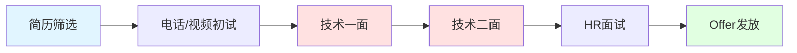
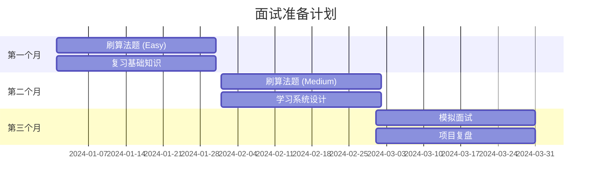

## 📘 面试宝典简介

技术面试是每个程序员职业发展的必经之路。本专栏收录了各大公司的面试题目、面试技巧、简历优化建议，帮助你顺利通过技术面试，拿到心仪的 Offer。

从算法题到系统设计，从基础知识到项目经验，我们为你准备了全方位的面试指南。

### 🎯 面试准备

- 📝 **简历优化**: 如何写出吸引人的技术简历
- 💻 **算法刷题**: LeetCode、剑指 Offer 经典题解
- 🏗️ **系统设计**: 高并发、分布式系统设计
- 🗣️ **行为面试**: STAR 法则、项目经验描述
- 🧠 **基础知识**: 操作系统、网络、数据库
- 💡 **面试技巧**: 沟通技巧、时间管理

---

## 📚 面试内容分类

<CardGrid>
  <Card title="算法题" icon="🧮">
    - 数组/链表/树<br/>
    - 动态规划<br/>
    - 图算法<br/>
    - 字符串处理
  </Card>
  
  <Card title="基础知识" icon="📖">
    - 操作系统<br/>
    - 计算机网络<br/>
    - 数据库<br/>
    - 设计模式
  </Card>
  
  <Card title="框架/语言" icon="💻">
    - Java/Go/Python<br/>
    - Spring/Gin<br/>
    - MySQL/Redis<br/>
    - 消息队列
  </Card>
  
  <Card title="系统设计" icon="🏗️">
    - 高并发系统<br/>
    - 分布式架构<br/>
    - 微服务设计<br/>
    - 缓存策略
  </Card>
</CardGrid>

---

## 🎓 面试流程

### 典型面试流程



### 各轮面试重点

- **一面**: 基础知识 + 算法题 (60-90分钟)
- **二面**: 项目经验 + 系统设计 (60-90分钟)
- **三面**: 架构能力 + 综合素质 (45-60分钟)
- **HR面**: 软技能 + 薪资谈判 (30-45分钟)

---

## 📊 高频考点

### 后端开发

| 知识点 | 重要程度 | 常见问题 |
|--------|---------|---------|
| **数据结构与算法** | ⭐⭐⭐⭐⭐ | LeetCode Hot 100 |
| **MySQL** | ⭐⭐⭐⭐⭐ | 索引、事务、锁 |
| **Redis** | ⭐⭐⭐⭐⭐ | 缓存策略、持久化 |
| **并发编程** | ⭐⭐⭐⭐ | 线程池、锁机制 |
| **Spring/框架** | ⭐⭐⭐⭐ | IOC、AOP、事务 |
| **消息队列** | ⭐⭐⭐ | Kafka、RabbitMQ |
| **分布式** | ⭐⭐⭐ | CAP、一致性hash |

---

## 🔗 学习资源

### 面试题库
- [LeetCode](https://leetcode.cn/) - 算法题必刷
- [牛客网面经](https://www.nowcoder.com/discuss) - 真实面经分享
- [剑指 Offer](https://leetcode.cn/problem-list/xb9nqhhg/) - 经典题目
- [GitHub 面试宝典](https://github.com/wolverinn/Waking-Up) - 开源资料

### 系统设计
- [System Design Primer](https://github.com/donnemartin/system-design-primer)
- [ByteByteGo](https://bytebytego.com/) - 图解系统设计
- [Grokking the System Design Interview](https://www.educative.io/)

### 面试经验
- [掘金面试专栏](https://juejin.cn/tag/面试)
- [知乎技术面试话题](https://www.zhihu.com/topic/19559424/)

---

## ❓ 常见问题

### Q: 如何准备算法面试？
A:
1. **基础**: 掌握常见数据结构和算法
2. **刷题**: LeetCode Easy 100题 + Medium 100题
3. **总结**: 按类型整理解题模板
4. **模拟**: 限时刷题，模拟真实场景
5. **复习**: 定期回顾做过的题

### Q: 项目经验如何准备？
A: 使用 **STAR 法则**:
- **S**ituation: 项目背景
- **T**ask: 你的任务/角色
- **A**ction: 具体行动和技术选型
- **R**esult: 项目成果和数据

### Q: 如何回答"你的缺点是什么"？
A:
- ✅ 真实但不致命的缺点
- ✅ 说明如何改进
- ❌ 避免"完美主义"等套话
- ❌ 不要说核心技能的缺陷

---

## 💡 面试技巧

### 算法题解题步骤

1. **理解题意**: 确认输入输出，询问边界条件
2. **沟通思路**: 说出你的想法，不要闷头写代码
3. **暴力求解**: 先给出能work的解法
4. **优化方案**: 分析复杂度，提出优化思路
5. **编码实现**: 边写边解释
6. **测试用例**: 主动测试边界情况

### 系统设计答题框架

1. **需求澄清**: 功能需求、非功能需求（QPS、用户量）
2. **概要设计**: 画出架构图，说明各组件职责
3. **深入设计**: 数据库设计、API设计、缓存策略
4. **权衡取舍**: 讨论不同方案的优缺点
5. **扩展性**: 如何应对流量增长

---

## 📝 简历优化

### 优秀简历要素

- ✅ **简洁明了**: 1-2页，重点突出
- ✅ **量化成果**: 用数据说话（提升XX%）
- ✅ **技术栈匹配**: 对应JD的技术要求
- ✅ **项目亮点**: 突出难点和解决方案
- ✅ **开源贡献**: GitHub/技术博客加分

### 简历检查清单

```markdown
□ 联系方式完整（邮箱、手机、GitHub）
□ 技术栈与目标岗位匹配
□ 项目经验有量化数据
□ 突出个人贡献和亮点
□ 无错别字和格式问题
□ PDF格式，文件名规范
```

---

## 📈 备考计划

### 3个月备考路线



**第1月**: 基础+简单算法题 (LeetCode Easy)
**第2月**: 进阶算法+系统设计
**第3月**: 模拟面试+项目准备

---

## 📝 最近更新

<CardGrid>
  <Card title="📊 文档统计" icon="📈">
    本站收录了 <strong>23 篇</strong> 面试相关文档<br/>
    涵盖算法、八股文、系统设计<br/>
    <small>最后更新: <CustomDateTime /></small>
  </Card>
  
  <Card title="🎯 重点准备" icon="🎓">
    <strong>必刷</strong>: LeetCode Hot 100<br/>
    <strong>必背</strong>: Java/MySQL/Redis 八股<br/>
    <strong>必会</strong>: 1-2个系统设计案例
  </Card>
</CardGrid>

<br/>

<Yiyan />