::: note Redis 是一种基于内存的数据库，对数据的读写操作都是在内存中完成，因此`读写速度非常快`，常用于`缓存`，`消息队列`、`分布式锁`等场景。
:::

Redis 提供了多种数据类型来支持不同的业务场景，比如 `String`(字符串)、`Hash`(哈希)、`List` (列表)、`Set`(集合)、`Zset`(有序集合)、`Bitmaps`（位图）、`HyperLogLog`（基数统计）、`GEO`（地理信息）、`Stream`（流），并且对数据类型的操作都是`原子性`的，因为执行命令由`单线程`负责的，不存在并发竞争的问题。

除此之外，Redis 还支持`事务`、`持久化`、`Lua 脚本`、`多种集群方案`（主从复制模式、哨兵模式、切片集群模式）、`发布/订阅模式`，`内存淘汰机制`、`过期删除机制`等等。

## **认识 Redis**
## 1. Redis 和 Memcached 有什么区别？

很多人都说用 Redis 作为缓存，但是 Memcached 也是基于内存的数据库，为什么不选择它作为缓存呢？要解答这个问题，我们就要弄清楚 Redis 和 Memcached 的区别。 

### Redis 与 Memcached `共同点`：

- 都是基于内存的数据库，一般都用来当做缓存使用。
- 都有过期策略。
- 两者的性能都非常高。

### Redis 与 Memcached `区别`：

- Redis 支持的`数据类型更丰富`（String、Hash、List、Set、ZSet），而 Memcached 只支持最简单的 key-value 数据类型；
- Redis 支持数据的`持久化`，可以将内存中的数据保持在磁盘中，重启的时候可以再次加载进行使用，而 Memcached 没有持久化功能，数据全部存在内存之中，Memcached 重启或者挂掉后，数据就没了；
- Redis 原生支持`集群模式`，Memcached 没有原生的集群模式，需要依靠客户端来实现往集群中分片写入数据；
- Redis 支持`发布订阅模型`、`Lua 脚本`、`事务`等功能，而 Memcached 不支持；


## 2. 为什么用 Redis 作为 MySQL 的缓存？
主要是因为 Redis 具备「高性能」和「高并发」两种特性。

### 2.1、Redis 具备高性能

假如用户第一次访问 MySQL 中的某些数据。这个过程会比较慢，因为是从硬盘上读取的。将该用户访问的数据缓存在 Redis 中，这样下一次再访问这些数据的时候就可以直接从缓存中获取了，操作 Redis 缓存就是直接操作内存，所以速度相当快。

如果 MySQL 中的对应数据改变了之后，同步改变 Redis 缓存中相应的数据即可，不过这里会有 Redis 和 MySQL 双写一致性的问题，后面我们会提到。

### 2.2、Redis 具备高并发

单台设备的 Redis 的 QPS（Query Per Second，每秒钟处理完请求的次数）是 MySQL 的 10 倍，Redis 单机的 QPS 能轻松破 10w，而 MySQL 单机的 QPS 很难破 1w。

所以，直接访问 Redis 能够承受的请求是远远大于直接访问 MySQL 的，所以我们可以考虑把数据库中的部分数据转移到缓存中去，这样用户的一部分请求会直接到缓存这里而不用经过数据库。

## **Redis 数据结构**
## 3. Redis 的数据类型有哪些？

Redis 支持的数据类型有：

|类型 |简介	|特性	|场景|
|:---:|:---:|:---:|:---:|
String（字符串）|	二进制安全	|可以包含任何数据，比如 JPG 图片或者序列化的对象，一个键最大能存储 512M	|简短的字符场景
Hash（哈希）|	键值对集合，即编程语言中的 Map 类型	|适合存储对象，并且可以像数据库中 update 一个属性一样只修改某一项属性值（Memcached 中需要取出整个字符串反序列化成对象修改完再序列化存回去）	|存储、读取、修改用户属性
List（列表)|	链表（双向链表)	|增删快，提供了操作某一段元素的 API	|①最新消息排行等功能（比如朋友圈的时间线）； ②消息队列
Set（集合)	|哈希表实现，元素不重复	|①添加、删除，查找的复杂度都是 O(1) ②为集合提供了求交集、并集、差集等操作	|①共同好友； ②利用唯一性，统计访问网站的所有独立 IP； ③好友推荐时，根据 tag 求交集，大于某个阈值就可以推荐
ZSet（有序集合）|	将 Set 中的元素增加一个权重参数 score，元素按 score 有序排列	|数据插入集合时，已经进行天然排序	|①排行榜； ②带权重的消息队列

> 随着 Redis 版本的更新，后面又支持了四种数据类型： `BitMap`（2.2 版新增）、`HyperLogLog`（2.8 版新增）、`GEO`（3.2 版新增）、`Stream`（5.0 版新增）。


### Redis 五种数据类型的应用场景：

- String 类型的应用场景：缓存对象、常规计数、分布式锁、共享 session 信息等。
- List 类型的应用场景：消息队列（但是有两个问题：1. 生产者需要自行实现全局唯一 ID；2. 不能以消费组形式消费数据）等。
- Hash 类型：缓存对象、购物车等。
- Set 类型：聚合计算（并集、交集、差集）场景，比如点赞、共同关注、抽奖活动等。
- Zset 类型：排序场景，比如排行榜、电话和姓名排序等。

### Redis 后续版本又支持四种数据类型，它们的应用场景如下：

- BitMap（2.2 版新增）：二值状态统计的场景，比如签到、判断用户登陆状态、连续签到用户总数等；
- HyperLogLog（2.8 版新增）：海量数据基数统计的场景，比如百万级网页 UV 计数等；
- GEO（3.2 版新增）：存储地理位置信息的场景，比如滴滴叫车；
- Stream（5.0 版新增）：消息队列，相比于基于 List 类型实现的消息队列，有这两个特有的特性：自动生成全局唯一消息 ID，支持以消费组形式消费数据。

## **Redis 线程模型**
## 4. Redis 是单线程吗？
> Redis 单线程指的是「`接收客户端请求`->`解析请求` ->`进行数据读写等操作`->`发送数据给客户端`」这个过程是由一个线程（`主线程`）来完成的，这也是我们常说 Redis 是单线程的原因。

但是，`Redis 程序并不是单线程的`，Redis 在启动的时候，是会`启动后台线程`（BIO）的：

- Redis 在 2.6 版本，会启动 2 个后台线程，分别`处理关闭文件`、`AOF 刷盘`这两个任务；
- Redis 在 4.0 版本之后，新增了一个新的后台线程，用来`异步释放 Redis 内存`，也就是 `lazyfree` 线程。例如执行 unlink key / flushdb async / flushall async 等命令，会把这些删除操作交给后台线程来执行，好处是不会导致 Redis 主线程卡顿。因此，当我们要删除一个大 key 的时候，不要使用 del 命令删除，因为 del 是在主线程处理的，这样会导致 Redis 主线程卡顿，因此我们应该使用 [unlink 命令](https://redis.io/commands/unlink/)来异步删除大 key。

之所以 Redis 为「关闭文件、AOF 刷盘、释放内存」这些任务创建单独的线程来处理，是因为这些任务的操作都是很耗时的，如果把这些任务都放在主线程来处理，那么 Redis 主线程就很容易发生阻塞，这样就无法处理后续的请求了。

后台线程相当于一个消费者，生产者把耗时任务丢到任务队列中，消费者（BIO）不停轮询这个队列，拿出任务就去执行对应的方法即可。

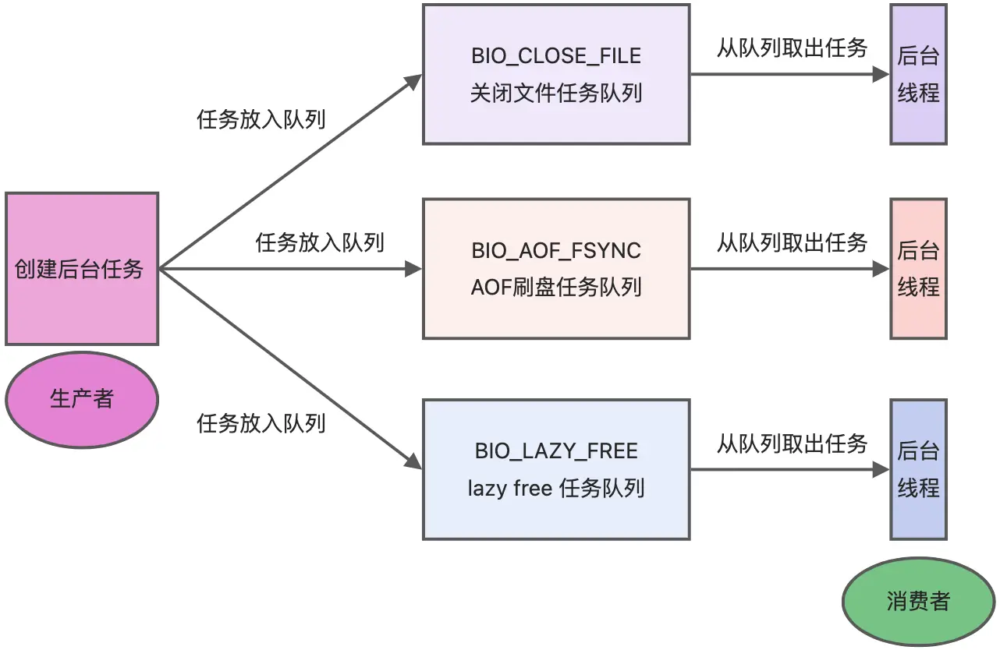

关闭文件、AOF 刷盘、释放内存这三个任务都有各自的任务队列：

- BIO_CLOSE_FILE，关闭文件任务队列：当队列有任务后，后台线程会调用 close(fd) ，将文件关闭；
- BIO_AOF_FSYNC，AOF 刷盘任务队列：当 AOF 日志配置成 everysec 选项后，主线程会把 AOF 写日志操作封装成一个任务，也放到队列中。当发现队列有任务后，后台线程会调用 fsync(fd)，将 AOF 文件刷盘，
- BIO_LAZY_FREE，lazy free 任务队列：当队列有任务后，后台线程会 free(obj) 释放对象 / free(dict) 删除数据库所有对象 / free(skiplist) 释放跳表对象；

## 5. Redis 单线程模式是怎样的？

> Redis 6.0 版本之前的单线模式如下图：


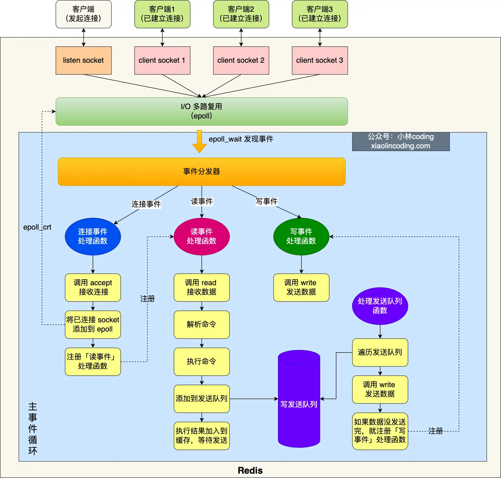

图中的蓝色部分是一个事件循环，是由主线程负责的，可以看到网络 I/O 和命令处理都是单线程。 Redis 初始化的时候，会做下面这几件事情：

- 首先，调用 epoll_create() 创建一个 epoll 对象和调用 socket() 一个服务端 socket
- 然后，调用 bind() 绑定端口和调用 listen() 监听该 socket；
- 然后，将调用 epoll_ctl() 将 listen socket 加入到 epoll，同时注册「连接事件」处理函数。

初始化完后，主线程就进入到一个`事件循环函数`，主要会做以下事情：

- 首先，先调用`处理发送队列函数`，看是发送队列里是否有任务，如果有发送任务，则通过 write 函数将客户端发送缓存区里的数据发送出去，如果这一轮数据没有发送完，就会注册写事件处理函数，等待 epoll_wait 发现可写后再处理。
- 接着，调用 epoll_wait 函数等待事件的到来：
    - 如果是`连接事件`到来，则会调用`连接事件处理函数`，该函数会做这些事情：调用 accpet 获取已连接的 socket -> 调用 epoll_ctl 将已连接的 socket 加入到 epoll -> 注册「读事件」处理函数；
    - 如果是`读事件`到来，则会调用`读事件处理函数`，该函数会做这些事情：调用 read 获取客户端发送的数据 -> 解析命令 -> 处理命令 -> 将客户端对象添加到发送队列 -> 将执行结果写到发送缓存区等待发送；
    - 如果是`写事件`到来，则会调用`写事件处理函数`，该函数会做这些事情：通过 write 函数将客户端发送缓存区里的数据发送出去，如果这一轮数据没有发送完，就会继续注册写事件处理函数，等待 epoll_wait 发现可写后再处理。


## 6. Redis 采用单线程为什么还这么快？

之所以 Redis 采用单线程（网络 I/O 和执行命令）那么快，有如下几个原因：

-  Redis 的大部分操作`都在内存中完成`，并且采用了高效的数据结构，因此 Redis 瓶颈可能是机器的内存或者网络带宽，而并非 CPU，既然 CPU 不是瓶颈，那么自然就采用单线程的解决方案了；
-  Redis 采用单线程模型可以`避免了多线程之间的竞争`，省去了多线程切换带来的时间和性能上的开销，而且也不会导致死锁问题。
-  Redis 采用了 `I/O 多路复`用机制处理大量的客户端 Socket 请求，IO 多路复用机制是指一个线程处理多个 IO 流，就是我们经常听到的 select/epoll 机制。简单来说，在 Redis 只运行单线程的情况下，该机制允许内核中，同时存在多个监听 Socket 和已连接 Socket。内核会一直监听这些 Socket 上的连接请求或数据请求。一旦有请求到达，就会交给 Redis 线程处理，这就实现了一个 Redis 线程处理多个 IO 流的效果。

## 7. Redis 6.0 之前为什么使用单线程？

Redis 官方给出的[FAQ](https://redis.io/docs/get-started/faq/)

核心意思是：`CPU 并不是制约 Redis 性能表现的瓶颈所在`，更多情况下是受到内存大小和网络 I/O 的限制，所以 Redis 核心网络模型使用单线程并没有什么问题，如果你想要使用服务的多核 CPU，可以在一台服务器上启动多个节点或者采用分片集群的方式。

除了上面的官方回答，选择单线程的原因也有下面的考虑。

使用了单线程后，可维护性高，多线程模型虽然在某些方面表现优异，但是它却引入了程序执行顺序的不确定性，带来了并发读写的一系列问题，`增加了系统复杂度、同时可能存在线程切换、甚至加锁解锁、死锁造成的性能损耗`。

## 8. Redis 6.0 之后为什么引入了多线程？

虽然 Redis 的主要工作（网络 I/O 和执行命令）一直是单线程模型，但是在 `Redis 6.0 版本之后，也采用了多个 I/O 线程来处理网络请求，这是因为随着网络硬件的性能提升，Redis 的性能瓶颈有时会出现在网络 I/O 的处理上。`

所以为了提高网络 I/O 的并行度，`Redis 6.0 对于网络 I/O采用多线程来处理。但是对于命令的执行，Redis 仍然使用单线程来处理，所以大家不要误解 Redis 有多线程同时执行命令`。

Redis 官方表示，Redis 6.0 版本引入的多线程 I/O 特性对性能提升至少是一倍以上。

Redis 6.0 版本支持的 I/O 多线程特性，默认情况下 I/O 多线程只针对发送响应数据（write client socket），并不会以多线程的方式处理读请求（read client socket）。要想开启多线程处理客户端读请求，就需要把 Redis.conf 配置文件中的 io-threads-do-reads 配置项设为 yes。

```shell
//读请求也使用 io 多线程
io-threads-do-reads yes 
```

同时，Redis.conf 配置文件中提供了 IO 多线程个数的配置项。

```shell
// io-threads N，表示启用 N-1 个 I/O 多线程（主线程也算一个 I/O 线程）
io-threads 4 
```

关于线程数的设置，官方的建议是如果为 4 核的 CPU，建议线程数设置为 2 或 3，如果为 8 核 CPU 建议线程数设置为 6，线程数一定要小于机器核数，线程数并不是越大越好。

因此，Redis 6.0 版本之后，Redis 在启动的时候，默认情况下会创建 6 个线程：

- Redis-server：Redis 的主线程，主要负责执行命令；
- bio_close_file、bio_aof_fsync、bio_lazy_free：三个后台线程，分别异步处理关闭文件任务、AOF 刷盘任务、释放内存任务；
- io_thd_1、io_thd_2、io_thd_3：三个 I/O 线程，io-threads 默认是 4，所以会启动 3（4-1）个 I/O 多线程，用来分担 Redis 网络 I/O 的压力。

## **Redis 持久化**
## 9.Redis 如何实现数据不丢失？

Redis 的读写操作都是在内存中，所以 Redis 性能才会高，但是当 Redis 重启后，内存中的数据就会丢失，那为了保证内存中的数据不会丢失，Redis 实现了数据持久化的机制，这个机制会把数据存储到磁盘，这样在 Redis 重启就能够从磁盘中恢复原有的数据。

Redis 共有三种数据持久化的方式：

- `AOF 日志`：每执行一条写操作命令，就把该命令以追加的方式写入到一个文件里；
- `RDB 快照`：将某一时刻的内存数据，以二进制的方式写入磁盘；
- `混合持久化方式`：Redis 4.0 新增的方式，集成了 AOF 和 RBD 的优点；

## 10. AOF 日志是如何实现的？
> Redis 在执行完一条写操作命令后，就会把该命令以追加的方式写入到一个文件里，然后 Redis 重启时，会读取该文件记录的命令，然后逐一执行命令的方式来进行数据恢复。


我这里以「set name xiaolin」命令作为例子，Redis 执行了这条命令后，记录在 AOF 日志里的内容如下图：


我这里给大家解释下。

「*3」表示当前命令有三个部分，每部分都是以「$+数字」开头，后面紧跟着具体的命令、键或值。然后，这里的「数字」表示这部分中的命令、键或值一共有多少字节。例如，「$3 set」表示这部分有 3 个字节，也就是「set」命令这个字符串的长度。

> 为什么先执行命令，再把数据写入日志呢？

Reids 是先执行写操作命令后，才将该命令记录到 AOF 日志里的，这么做其实有两个好处。

- `避免额外的检查开销`：因为如果先将写操作命令记录到 AOF 日志里，再执行该命令的话，如果当前的命令语法有问题，那么如果不进行命令语法检查，该错误的命令记录到 AOF 日志里后，Redis 在使用日志恢复数据时，就可能会出错。
- `不会阻塞当前写操作命令的执行`：因为当写操作命令执行成功后，才会将命令记录到 AOF 日志。

当然，这样做也会带来风险：

- `数据可能会丢失`： 执行写操作命令和记录日志是两个过程，那当 Redis 在还没来得及将命令写入到硬盘时，服务器发生宕机了，这个数据就会有丢失的风险。
- `可能阻塞其他操作`： 由于写操作命令执行成功后才记录到 AOF 日志，所以不会阻塞当前命令的执行，但因为 AOF 日志也是在主线程中执行，所以当 Redis 把日志文件写入磁盘的时候，还是会阻塞后续的操作无法执行。

> AOF 写回策略有几种？

先来看看，Redis 写入 AOF 日志的过程，如下图：


具体说说：

1. Redis 执行完写操作命令后，会将命令追加到 server.aof_buf 缓冲区；
2. 然后通过 write() 系统调用，将 aof_buf 缓冲区的数据写入到 AOF 文件，此时数据并没有写入到硬盘，而是拷贝到了内核缓冲区 page cache，等待内核将数据写入硬盘；
3. 具体内核缓冲区的数据什么时候写入到硬盘，由内核决定。

Redis 提供了 3 种写回硬盘的策略，控制的就是上面说的第三步的过程。 在 `Redis.conf` 配置文件中的 `appendfsync` 配置项可以有以下 3 种参数可填：

1. `Always`，这个单词的意思是「总是」，所以它的意思是每次写操作命令执行完后，同步将 AOF 日志数据写回硬盘；
2. `Everysec`，这个单词的意思是「每秒」，所以它的意思是每次写操作命令执行完后，先将命令写入到 AOF 文件的内核缓冲区，然后每隔一秒将缓冲区里的内容写回到硬盘；
3. `No`，意味着不由 Redis 控制写回硬盘的时机，转交给操作系统控制写回的时机，也就是每次写操作命令执行完后，先将命令写入到 AOF 文件的内核缓冲区，再由操作系统决定何时将缓冲区内容写回硬盘。

我也把这 3 个写回策略的优缺点总结成了一张表格：

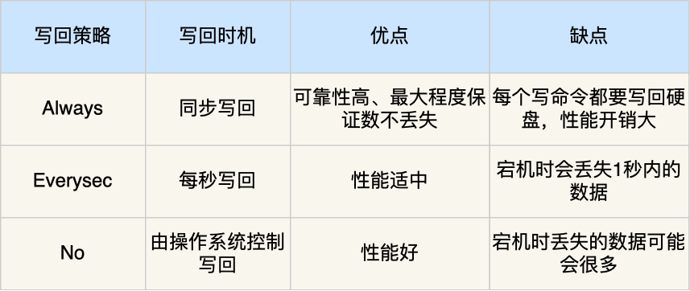

> AOF 日志过大，会触发什么机制？

AOF 日志是一个文件，随着执行的写操作命令越来越多，文件的大小会越来越大。 如果当 AOF 日志文件过大就会带来性能问题，比如重启 Redis 后，需要读 AOF 文件的内容以恢复数据，如果文件过大，整个恢复的过程就会很慢。

所以，Redis 为了避免 AOF 文件越写越大，提供了 `AOF 重写机制`，当 AOF 文件的大小超过所设定的阈值后，Redis 就会启用 AOF 重写机制，来压缩 AOF 文件。

AOF 重写机制是在重写时，读取当前数据库中的所有键值对，然后将每一个键值对用一条命令记录到「新的 AOF 文件」，等到全部记录完后，就将新的 AOF 文件替换掉现有的 AOF 文件。

举个例子，在没有使用重写机制前，假设前后执行了「set name xiaolin」和「set name xiaolincoding」这两个命令的话，就会将这两个命令记录到 AOF 文件。


但是在`使用重写机制后，就会读取 name 最新的 value（键值对） ，然后用一条「set name xiaolincoding」命令记录到新的 AOF 文件`，之前的第一个命令就没有必要记录了，因为它属于「历史」命令，没有作用了。这样一来，一个键值对在重写日志中只用一条命令就行了。

重写工作完成后，就会将新的 AOF 文件覆盖现有的 AOF 文件，这就相当于压缩了 AOF 文件，使得 AOF 文件体积变小了。

> 重写 AOF 日志的过程是怎样的？

Redis 的`重写 AOF 过程是由后台子进程 bgrewriteaof 来完成的`，这么做可以达到两个好处：

- 子进程进行 AOF 重写期间，主进程可以继续处理命令请求，从而避免阻塞主进程；
- 子进程带有主进程的数据副本，这里使用子进程而不是线程，因为如果是使用线程，多线程之间会共享内存，那么在修改共享内存数据的时候，需要通过加锁来保证数据的安全，而这样就会降低性能。而使用子进程，创建子进程时，父子进程是共享内存数据的，不过这个共享的内存只能以只读的方式，而当父子进程任意一方修改了该共享内存，就会发生「写时复制」，于是父子进程就有了独立的数据副本，就不用加锁来保证数据安全。

触发重写机制后，主进程就会创建重写 AOF 的子进程，此时父子进程共享物理内存，重写子进程只会对这个内存进行只读，重写 AOF 子进程会读取数据库里的所有数据，并逐一把内存数据的键值对转换成一条命令，再将命令记录到重写日志（新的 AOF 文件）。

`但是重写过程中，主进程依然可以正常处理命令`，那问题来了，重写 AOF 日志过程中，如果主进程修改了已经存在 key-value，那么会发生写时复制，此时这个 key-value 数据在子进程的内存数据就跟主进程的内存数据不一致了，这时要怎么办呢？

为了解决这种数据不一致问题，Redis 设置了一个 `AOF 重写缓冲区`，这个缓冲区在创建 bgrewriteaof 子进程之后开始使用。

在重写 AOF 期间，当 Redis 执行完一个写命令之后，它会`同时将这个写命令写入到「AOF 缓冲区」和「AOF 重写缓冲区」`。


也就是说，在 bgrewriteaof 子进程执行 AOF 重写期间，主进程需要执行以下三个工作：

- 执行客户端发来的命令；
- 将执行后的写命令追加到「AOF 缓冲区」；
- 将执行后的写命令追加到「AOF 重写缓冲区」；

当子进程完成 AOF 重写工作（扫描数据库中所有数据，逐一把内存数据的键值对转换成一条命令，再将命令记录到重写日志）后，会向主进程发送一条信号，信号是进程间通讯的一种方式，且是异步的。

主进程收到该信号后，会调用一个信号处理函数，该函数主要做以下工作：

- 将 AOF 重写缓冲区中的所有内容追加到新的 AOF 的文件中，使得新旧两个 AOF 文件所保存的数据库状态一致；
- 新的 AOF 的文件进行改名，覆盖现有的 AOF 文件。

信号函数执行完后，主进程就可以继续像往常一样处理命令了。

## 11. RDB 快照是如何实现的呢？

因为 AOF 日志记录的是操作命令，不是实际的数据，所以用 AOF 方法做故障恢复时，需要全量把日志都执行一遍，一旦 AOF 日志非常多，势必会造成 Redis 的恢复操作缓慢。

为了解决这个问题，Redis 增加了 RDB 快照。所谓的快照，就是记录某一个瞬间东西，比如当我们给风景拍照时，那一个瞬间的画面和信息就记录到了一张照片。

所以，RDB 快照就是记录某一个瞬间的内存数据，记录的是实际数据，而 AOF 文件记录的是命令操作的日志，而不是实际的数据。

因此在 Redis 恢复数据时，RDB 恢复数据的效率会比 AOF 高些，因为直接将 RDB 文件读入内存就可以，不需要像 AOF 那样还需要额外执行操作命令的步骤才能恢复数据。

> RDB 做快照时会阻塞线程吗？

Redis 提供了两个命令来生成 RDB 文件，分别是 save 和 bgsave，他们的区别就在于是否在「主线程」里执行：

- 执行了 save 命令，就会在主线程生成 RDB 文件，由于和执行操作命令在同一个线程，所以如果写入 RDB 文件的时间太长，`会阻塞主线程`；
- 执行了 bgsave 命令，会创建一个子进程来生成 RDB 文件，这样可以`避免主线程的阻塞`；

Redis 还可以通过配置文件的选项来实现每隔一段时间自动执行一次 bgsave 命令，默认会提供以下配置：

```shell
save 900 1
save 300 10
save 60 10000
```
别看选项名叫 save，实际上执行的是 bgsave 命令，也就是会创建子进程来生成 RDB 快照文件。 只要满足上面条件的任意一个，就会执行 bgsave，它们的意思分别是：

- 900 秒之内，对数据库进行了至少 1 次修改；
- 300 秒之内，对数据库进行了至少 10 次修改；
- 60 秒之内，对数据库进行了至少 10000 次修改。

这里提一点，Redis 的快照是全量快照，也就是说每次执行快照，都是把内存中的「所有数据」都记录到磁盘中。所以执行快照是一个比较重的操作，如果频率太频繁，可能会对 Redis 性能产生影响。如果频率太低，服务器故障时，丢失的数据会更多。

> RDB 在执行快照的时候，数据能修改吗？

可以的，执行 bgsave 过程中，Redis 依然`可以继续处理操作命令`的，也就是数据是能被修改的，关键的技术就在于`写时复制技术`（Copy-On-Write, COW）。

执行 bgsave 命令的时候，会通过 fork() 创建子进程，此时子进程和父进程是共享同一片内存数据的，因为创建子进程的时候，会复制父进程的页表，但是页表指向的物理内存还是一个，此时如果主线程执行读操作，则主线程和 bgsave 子进程互相不影响。


如果主线程执行写操作，则被修改的数据会复制一份副本，然后 bgsave 子进程会把该副本数据写入 RDB 文件，在这个过程中，主线程仍然可以直接修改原来的数据。


## 12. 为什么会有混合持久化？

RDB 优点是数据恢复速度快，但是快照的频率不好把握。频率太低，丢失的数据就会比较多，频率太高，就会影响性能。

AOF 优点是丢失数据少，但是数据恢复不快。

为了集成了两者的优点，`Redis 4.0` 提出了`混合使用 AOF 日志和内存快照`，也叫混合持久化，既保证了 Redis 重启速度，又降低数据丢失风险。

混合持久化工作在 `AOF 日志重写过程`，当开启了混合持久化时，在 AOF 重写日志时，fork 出来的重写子进程会先将与主线程共享的内存数据以 RDB 方式写入到 AOF 文件，然后主线程处理的操作命令会被记录在重写缓冲区里，重写缓冲区里的增量命令会以 AOF 方式写入到 AOF 文件，写入完成后通知主进程将新的含有 RDB 格式和 AOF 格式的 AOF 文件替换旧的的 AOF 文件。

也就是说，使用了混合持久化，AOF 文件的`前半部分是 RDB 格式的全量数据，后半部分是 AOF 格式的增量数据`。


这样的好处在于，重启 Redis 加载数据的时候，由于前半部分是 RDB 内容，`这样加载的时候速度会很快`。

加载完 RDB 的内容后，才会加载后半部分的 AOF 内容，这里的内容是 Redis 后台子进程重写 AOF 期间，主线程处理的操作命令，可以使得`数据更少的丢失`。

混合持久化优点：

- 混合持久化结合了 RDB 和 AOF 持久化的优点，开头为 RDB 的格式，使得 Redis 可以`更快的启动`，同时结合 AOF 的优点，有`减低了大量数据丢失的风险`。

混合持久化缺点：

- AOF 文件中添加了 RDB 格式的内容，使得 AOF 文件的`可读性变得很差`；
- 兼容性差，如果开启混合持久化，那么此混合持久化 AOF 文件，就不能用在 `Redis 4.0` 之前版本了。

## **Redis 集群**
## 13. Redis 如何实现服务高可用？

要想设计一个高可用的 Redis 服务，一定要从 Redis 的多服务节点来考虑，比如 Redis 的主从复制、哨兵模式、切片集群。

> 主从复制

主从复制是 Redis 高可用服务的最基础的保证，实现方案就是将从前的一台 Redis 服务器，同步数据到多台从 Redis 服务器上，即一主多从的模式，且主从服务器之间采用的是「读写分离」的方式。

主服务器可以进行读写操作，当发生写操作时自动将写操作同步给从服务器，而从服务器一般是只读，并接受主服务器同步过来写操作命令，然后执行这条命令。

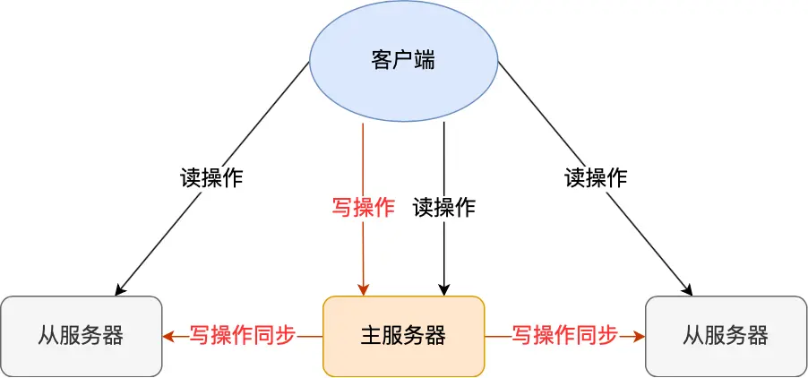

也就是说，所有的数据修改只在主服务器上进行，然后将最新的数据同步给从服务器，这样就使得主从服务器的数据是一致的。

注意，主从服务器之间的命令复制是**异步**进行的。

具体来说，在主从服务器命令传播阶段，主服务器收到新的写命令后，会发送给从服务器。但是，主服务器并不会等到从服务器实际执行完命令后，再把结果返回给客户端，而是主服务器自己在本地执行完命令后，就会向客户端返回结果了。如果从服务器还没有执行主服务器同步过来的命令，主从服务器间的数据就不一致了。

所以，无法实现强一致性保证（主从数据时时刻刻保持一致），数据不一致是难以避免的。

> 哨兵模式

在使用 Redis 主从服务的时候，会有一个问题，就是当 Redis 的主从服务器出现故障宕机时，需要手动进行恢复。

为了解决这个问题，Redis 增加了哨兵模式（Redis Sentinel），因为哨兵模式做到了可以监控主从服务器，并且提供`主从节点故障转移`的功能。


> 切片集群模式

当 Redis 缓存数据量大到一台服务器无法缓存时，就需要使用 Redis 切片集群（Redis Cluster ）方案，它将数据分布在不同的服务器上，以此来降低系统对单主节点的依赖，从而提高 Redis 服务的读写性能。

Redis Cluster 方案采用哈希槽（Hash Slot），来处理数据和节点之间的映射关系。在 Redis Cluster 方案中，`一个切片集群共有 16384 个哈希槽`，这些哈希槽类似于数据分区，每个键值对都会根据它的 key，被映射到一个哈希槽中，具体执行过程分为两大步：

- 根据键值对的 key，按照 `CRC16` 算法 (opens new window)计算一个 16 bit 的值。
- 再用 16bit 值对 16384 取模，得到 0~16383 范围内的模数，每个模数代表一个相应编号的哈希槽。

接下来的问题就是，这些哈希槽怎么被映射到具体的 Redis 节点上的呢？有两种方案：

- `平均分配`： 在使用 cluster create 命令创建 Redis 集群时，Redis 会自动把所有哈希槽平均分布到集群节点上。比如集群中有 9 个节点，则每个节点上槽的个数为 16384/9 个。
- `手动分配`： 可以使用 cluster meet 命令手动建立节点间的连接，组成集群，再使用 cluster addslots 命令，指定每个节点上的哈希槽个数。

为了方便你的理解，我通过一张图来解释数据、哈希槽，以及节点三者的映射分布关系。

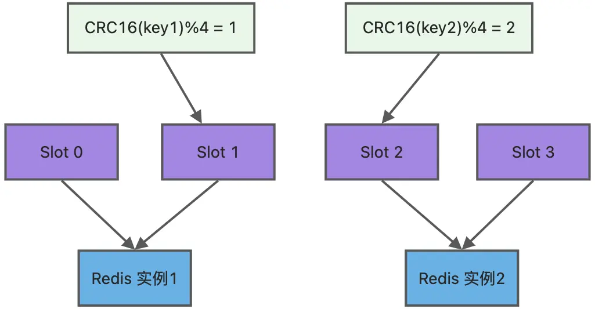


上图中的切片集群一共有 2 个节点，假设有 4 个哈希槽（Slot 0～Slot 3）时，我们就可以通过命令手动分配哈希槽，比如节点 1 保存哈希槽 0 和 1，节点 2 保存哈希槽 2 和 3。

```shell
redis-cli -h 192.168.1.10 –p 6379 cluster addslots 0,1
redis-cli -h 192.168.1.11 –p 6379 cluster addslots 2,3
```

然后在集群运行的过程中，key1 和 key2 计算完 CRC16 值后，对哈希槽总个数 4 进行取模，再根据各自的模数结果，就可以被映射到哈希槽 1（对应节点1） 和 哈希槽 2（对应节点2）。

需要注意的是，在手动分配哈希槽时，需要把 16384 个槽都分配完，否则 Redis 集群无法正常工作。


## 14. 集群脑裂导致数据丢失怎么办？

> 什么是脑裂？

先来理解集群的脑裂现象，这就好比一个人有两个大脑，那么到底受谁控制呢？

那么在 Redis 中，集群脑裂产生数据丢失的现象是怎样的呢？

在 Redis 主从架构中，部署方式一般是「一主多从」，主节点提供写操作，从节点提供读操作。 如果主节点的网络突然发生了问题，它与所有的从节点都失联了，但是此时的主节点和客户端的网络是正常的，这个客户端并不知道 Redis 内部已经出现了问题，还在照样的向这个失联的主节点写数据（过程A），此时这些数据被旧主节点缓存到了缓冲区里，因为主从节点之间的网络问题，这些数据都是无法同步给从节点的。

这时，哨兵也发现主节点失联了，它就认为主节点挂了（但实际上主节点正常运行，只是网络出问题了），于是哨兵就会在「从节点」中选举出一个 leader 作为主节点，这时集群就有两个主节点了 —— `脑裂出现了。`

然后，网络突然好了，哨兵因为之前已经选举出一个新主节点了，它就会把旧主节点降级为从节点（A），然后从节点（A）会向新主节点请求数据同步，`因为第一次同步是全量同步的方式，此时的从节点（A）会清空掉自己本地的数据，然后再做全量同步。所以，之前客户端在过程 A 写入的数据就会丢失了，也就是集群产生脑裂数据丢失的问题。`

总结一句话就是：由于网络问题，集群节点之间失去联系。主从数据不同步；重新平衡选举，产生两个主服务。等网络恢复，旧主节点会降级为从节点，再与新主节点进行同步复制的时候，由于会从节点会清空自己的缓冲区，所以导致之前客户端写入的数据丢失了。

> 解决方案

当主节点发现从节点下线或者通信超时的总数量小于阈值时，那么禁止主节点进行写数据，直接把错误返回给客户端。

在 Redis 的配置文件中有两个参数我们可以设置：

- min-slaves-to-write x，主节点必须要有至少 x 个从节点连接，如果小于这个数，主节点会禁止写数据。
- min-slaves-max-lag x，主从数据复制和同步的延迟不能超过 x 秒，如果超过，主节点会禁止写数据。

我们可以把 min-slaves-to-write 和 min-slaves-max-lag 这两个配置项搭配起来使用，分别给它们设置一定的阈值，假设为 N 和 T。

这两个配置项组合后的要求是，主库连接的从库中至少有 N 个从库，和主库进行数据复制时的 ACK 消息延迟不能超过 T 秒，否则，主库就不会再接收客户端的写请求了。

即使原主库是假故障，它在假故障期间也无法响应哨兵心跳，也不能和从库进行同步，自然也就无法和从库进行 ACK 确认了。这样一来，min-slaves-to-write 和 min-slaves-max-lag 的组合要求就无法得到满足，`原主库就会被限制接收客户端写请求，客户端也就不能在原主库中写入新数据了。`

`等到新主库上线时，就只有新主库能接收和处理客户端请求，此时，新写的数据会被直接写到新主库中。而原主库会被哨兵降为从库，即使它的数据被清空了，也不会有新数据丢失。`

再来举个例子。

假设我们将 min-slaves-to-write 设置为 1，把 min-slaves-max-lag 设置为 12s，把哨兵的 down-after-milliseconds 设置为 10s，主库因为某些原因卡住了 15s，导致哨兵判断主库客观下线，开始进行主从切换。

同时，因为原主库卡住了 15s，没有一个从库能和原主库在 12s 内进行数据复制，原主库也无法接收客户端请求了。

这样一来，主从切换完成后，也只有新主库能接收请求，不会发生脑裂，也就不会发生数据丢失的问题了。

## **Redis 过期删除与内存淘汰**
## 15. Redis 使用的过期删除策略是什么？

Redis 是可以对 key 设置过期时间的，因此需要有相应的机制将已过期的键值对删除，而做这个工作的就是过期键值删除策略。

每当我们对一个 key 设置了过期时间时，Redis 会把该 key 带上过期时间存储到一个`过期字典`（expires dict）中，也就是说「过期字典」保存了数据库中所有 key 的过期时间。

当我们查询一个 key 时，Redis 首先检查该 key 是否存在于过期字典中：

- 如果不在，则正常读取键值；
- 如果存在，则会获取该 key 的过期时间，然后与当前系统时间进行比对，如果比系统时间大，那就没有过期，否则判定该 key 已过期。

Redis 使用的过期删除策略是「惰性删除+定期删除」这两种策略配和使用。

> 什么是惰性删除策略？

惰性删除策略的做法是，`不主动删除过期键，每次从数据库访问 key 时，都检测 key 是否过期，如果过期则删除该 key`。

惰性删除的流程图如下：


惰性删除策略的`优点`：

- 因为每次访问时，才会检查 key 是否过期，所以此策略只会使用很少的系统资源，因此，惰性删除策略对 CPU 时间最友好。

惰性删除策略的`缺点`：

- 如果一个 key 已经过期，而这个 key 又仍然保留在数据库中，那么只要这个过期 key 一直没有被访问，它所占用的内存就不会释放，造成了一定的内存空间浪费。所以，惰性删除策略对内存不友好。

> 什么是定期删除策略？

定期删除策略的做法是，`每隔一段时间「随机」从数据库中取出一定数量的 key 进行检查，并删除其中的过期key。`

Redis 的定期删除的流程：

1. 从过期字典中随机抽取 20 个 key；
2. 检查这 20 个 key 是否过期，并删除已过期的 key；
3. 如果本轮检查的已过期 key 的数量，超过 5 个（20/4），也就是「已过期 key 的数量」占比「随机抽取 key 的数量」大于 25%，则继续重复步骤 1；如果已过期的 key 比例小于 25%，则停止继续删除过期 key，然后等待下一轮再检查。

可以看到，定期删除是一个循环的流程。那 Redis 为了保证定期删除不会出现循环过度，导致线程卡死现象，为此增加了定期删除循环流程的时间上限，默认不会超过 25ms。

定期删除的流程如下：

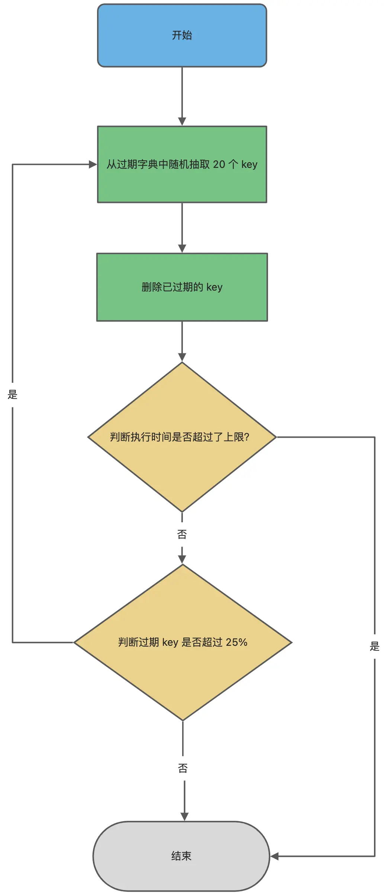

定期删除策略的优点：

- 通过限制删除操作执行的时长和频率，来减少删除操作对 CPU 的影响，同时也能删除一部分过期的数据减少了过期键对空间的无效占用。

定期删除策略的缺点：

- 难以确定删除操作执行的时长和频率。如果执行的太频繁，就会对 CPU 不友好；如果执行的太少，那又和惰性删除一样了，过期 key 占用的内存不会及时得到释放。

可以看到，惰性删除策略和定期删除策略都有各自的优点，所以 `Redis 选择「惰性删除+定期删除」这两种策略配和使用`，以求在合理使用 CPU 时间和避免内存浪费之间取得平衡。

## 16. Redis 持久化时，对过期键会如何处理的？

Redis 持久化文件有两种格式：RDB（Redis Database）和 AOF（Append Only File），下面我们分别来看过期键在这两种格式中的呈现状态。

RDB 文件分为两个阶段，RDB 文件生成阶段和加载阶段。

- `RDB 文件生成阶段`：从内存状态持久化成 RDB（文件）的时候，会对 key 进行过期检查，`过期的键「不会」被保存到新的 RDB 文件中`，因此 Redis 中的过期键不会对生成新 RDB 文件产生任何影响。
- `RDB 加载阶段`：RDB 加载阶段时，要看服务器是主服务器还是从服务器，分别对应以下两种情况：
    - `如果 Redis 是「主服务器」运行模式的话，在载入 RDB 文件时，程序会对文件中保存的键进行检查，过期键「不会」被载入到数据库中`。所以过期键不会对载入 RDB 文件的主服务器造成影响；
    - `如果 Redis 是「从服务器」运行模式的话，在载入 RDB 文件时，不论键是否过期都会被载入到数据库中。但由于主从服务器在进行数据同步时`，从服务器的数据会被清空。所以一般来说，过期键对载入 RDB 文件的从服务器也不会造成影响。

AOF 文件分为两个阶段，AOF 文件写入阶段和 AOF 重写阶段。

- `AOF 文件写入阶段`：当 Redis 以 AOF 模式持久化时，`如果数据库某个过期键还没被删除，那么 AOF 文件会保留此过期键，当此过期键被删除后，Redis 会向 AOF 文件追加一条 DEL 命令来显式地删除该键值。`
- `AOF 重写阶段`：执行 AOF 重写时，会对 Redis 中的键值对进行检查，`已过期的键不会被保存到重写后的 AOF 文件中`，因此不会对 AOF 重写造成任何影响。

## 17. Redis 主从模式中，对过期键会如何处理？

当 Redis 运行在主从模式下时，`从库不会进行过期扫描，从库对过期的处理是被动的`。也就是即使从库中的 key 过期了，如果有客户端访问从库时，依然可以得到 key 对应的值，像未过期的键值对一样返回。

从库的过期键处理依靠主服务器控制，主库在 key 到期时，会在 AOF 文件里增加一条 del 指令，同步到所有的从库，从库通过执行这条 del 指令来删除过期的 key。

## 18. Redis 内存满了，会发生什么？

在 Redis 的运行内存达到了某个阀值，就会触发`内存淘汰机制`，这个阀值就是我们设置的最大运行内存，此值在 Redis 的配置文件中可以找到，配置项为 `maxmemory`。

## 19. Redis 内存淘汰策略有哪些？

Redis 内存淘汰策略共有八种，这八种策略大体分为「不进行数据淘汰」和「进行数据淘汰」两类策略。

### 1、不进行数据淘汰的策略

`noeviction`（Redis3.0之后，默认的内存淘汰策略） ：它表示当运行内存超过最大设置内存时，不淘汰任何数据，而是不再提供服务，直接返回错误。

### 2、进行数据淘汰的策略

针对「进行数据淘汰」这一类策略，又可以细分为「在设置了过期时间的数据中进行淘汰」和「在所有数据范围内进行淘汰」这两类策略。 在设置了过期时间的数据中进行淘汰：

- `volatile-random`：随机淘汰设置了过期时间的任意键值；
- `volatile-ttl`：优先淘汰更早过期的键值。
- `volatile-lru`（Redis3.0 之前，默认的内存淘汰策略）：淘汰所有设置了过期时间的键值中，最久未使用的键值；
- `volatile-lfu`（Redis 4.0 后新增的内存淘汰策略）：淘汰所有设置了过期时间的键值中，最少使用的键值；

在所有数据范围内进行淘汰：

- `allkeys-random`：随机淘汰任意键值;
- `allkeys-lru`：淘汰整个键值中最久未使用的键值；
- `allkeys-lfu`（Redis 4.0 后新增的内存淘汰策略）：淘汰整个键值中最少使用的键值。

## 20. LRU 算法和 LFU 算法有什么区别？

> 什么是 LRU 算法？

`LRU` 全称是 Least Recently Used 翻译为`最近最少使用`，会选择淘汰最近最少使用的数据。

传统 LRU 算法的实现是基于「链表」结构，链表中的元素按照操作顺序从前往后排列，最新操作的键会被移动到表头，当需要内存淘汰时，只需要删除链表尾部的元素即可，因为链表尾部的元素就代表最久未被使用的元素。

Redis 并没有使用这样的方式实现 LRU 算法，因为传统的 LRU 算法存在两个问题：

- 需要用链表管理所有的缓存数据，这会带来额外的空间开销；
- 当有数据被访问时，需要在链表上把该数据移动到头端，如果有大量数据被访问，就会带来很多链表移动操作，会很耗时，进而会降低 Redis 缓存性能。

> Redis 是如何实现 LRU 算法的？

Redis 实现的是一种`近似 LRU 算法`，目的是为了更好的节约内存，它的`实现方式是在 Redis 的对象结构体中添加一个额外的字段，用于记录此数据的最后一次访问时间。`

当 Redis 进行内存淘汰时，会使用`随机采样的方式来淘汰数据`，它是随机取 5 个值（此值可配置），然后`淘汰最久没有使用的那个`。

Redis 实现的 LRU 算法的优点：

- 不用为所有的数据维护一个大链表，节省了空间占用；
- 不用在每次数据访问时都移动链表项，提升了缓存的性能；

但是 LRU 算法有一个问题，`无法解决缓存污染问题`，比如应用一次读取了大量的数据，而这些数据只会被读取这一次，那么这些数据会留存在 Redis 缓存中很长一段时间，造成缓存污染。

因此，在 Redis 4.0 之后引入了 LFU 算法来解决这个问题。

> 什么是 LFU 算法？

LFU 全称是 Least Frequently Used 翻译为`最近最不常用的`，LFU 算法是根据数据访问次数来淘汰数据的，它的核心思想是“如果数据过去被访问多次，那么将来被访问的频率也更高”。

所以， LFU 算法会记录每个数据的访问次数。当一个数据被再次访问时，就会增加该数据的访问次数。这样就解决了偶尔被访问一次之后，数据留存在缓存中很长一段时间的问题，相比于 LRU 算法也更合理一些。

> Redis 是如何实现 LFU 算法的？

LFU 算法相比于 LRU 算法的实现，多记录了「数据的访问频次」的信息。Redis 对象的结构如下：

```c
typedef struct redisObject {
    ...
      
    // 24 bits，用于记录对象的访问信息
    unsigned lru:24;  
    ...
} robj;
```

Redis 对象头中的 lru 字段，在 LRU 算法下和 LFU 算法下使用方式并不相同。

`在 LRU 算法中`，Redis 对象头的 24 bits 的 lru 字段是用来记录 key 的访问时间戳，因此在 LRU 模式下，Redis可以根据对象头中的 lru 字段记录的值，来比较最后一次 key 的访问时间长，从而淘汰最久未被使用的 key。

`在 LFU 算法中`，Redis对象头的 24 bits 的 lru 字段被分成两段来存储，高 16bit 存储 ldt(Last Decrement Time)，用来记录 key 的访问时间戳；低 8bit 存储 logc(Logistic Counter)，用来记录 key 的访问频次。


## **Redis 缓存设计**
## 21. 如何避免缓存雪崩、缓存击穿、缓存穿透？

> 如何避免缓存雪崩？

通常我们为了保证缓存中的数据与数据库中的数据一致性，会给 Redis 里的数据设置过期时间，当缓存数据过期后，用户访问的数据如果不在缓存里，业务系统需要重新生成缓存，因此就会访问数据库，并将数据更新到 Redis 里，这样后续请求都可以直接命中缓存。

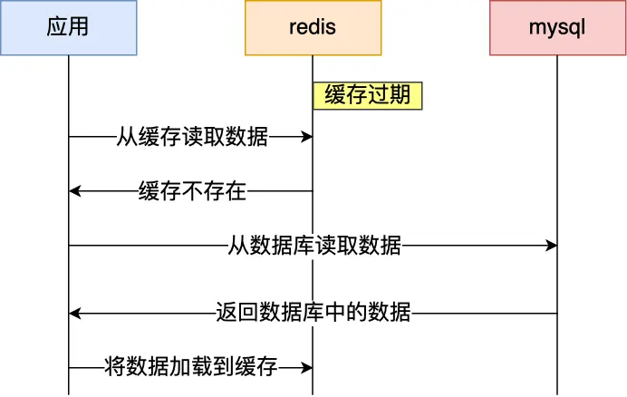

那么，当`大量缓存数据在同一时间过期（失效）时，如果此时有大量的用户请求，都无法在 Redis 中处理，于是全部请求都直接访问数据库，从而导致数据库的压力骤增，严重的会造成数据库宕机，从而形成一系列连锁反应，造成整个系统崩溃，这就是缓存雪崩的问题`。

对于缓存雪崩问题，我们可以采用两种方案解决。

- `将缓存失效时间随机打散`： 我们可以在原有的失效时间基础上增加一个随机值（比如 1 到 10 分钟）这样每个缓存的过期时间都不重复了，也就降低了缓存集体失效的概率。
- `设置缓存不过期`： 我们可以通过后台服务来更新缓存数据，从而避免因为缓存失效造成的缓存雪崩，也可以在一定程度上避免缓存并发问题。

> 如何避免缓存击穿？

我们的业务通常会有几个数据会被频繁地访问，比如秒杀活动，这类被频地访问的数据被称为热点数据。

如果缓存中的`某个热点数据过期`了，此时大量的请求访问了该热点数据，就无法从缓存中读取，直接访问数据库，数据库很容易就被高并发的请求冲垮，这就是`缓存击穿`的问题。


可以发现缓存击穿跟缓存雪崩很相似，你可以认为缓存击穿是缓存雪崩的一个子集。 应对缓存击穿可以采取前面说到两种方案：

- 互斥锁方案（Redis 中使用 setNX 方法设置一个状态位，表示这是一种锁定状态），保证同一时间只有一个业务线程请求缓存，未能获取互斥锁的请求，要么等待锁释放后重新读取缓存，要么就返回空值或者默认值。
- 不给热点数据设置过期时间，由后台异步更新缓存，或者在热点数据准备要过期前，提前通知后台线程更新缓存以及重新设置过期时间；

> 如何避免缓存穿透？

当发生缓存雪崩或击穿时，数据库中还是保存了应用要访问的数据，一旦缓存恢复相对应的数据，就可以减轻数据库的压力，而缓存穿透就不一样了。

当用户访问的数据，`既不在缓存中，也不在数据库中`，导致请求在访问缓存时，发现缓存缺失，再去访问数据库时，发现数据库中也没有要访问的数据，没办法构建缓存数据，来服务后续的请求。那么当有大量这样的请求到来时，数据库的压力骤增，这就是`缓存穿透`的问题。


缓存穿透的发生一般有这两种情况：

- 业务误操作，缓存中的数据和数据库中的数据都被误删除了，所以导致缓存和数据库中都没有数据；
- 黑客恶意攻击，故意大量访问某些读取不存在数据的业务；

应对缓存穿透的方案，常见的方案有三种。

- `非法请求的限制`：当有大量恶意请求访问不存在的数据的时候，也会发生缓存穿透，因此在 API 入口处我们要判断求请求参数是否合理，请求参数是否含有非法值、请求字段是否存在，如果判断出是恶意请求就直接返回错误，避免进一步访问缓存和数据库。
- `设置空值或者默认值`：当我们线上业务发现缓存穿透的现象时，可以针对查询的数据，在缓存中设置一个空值或者默认值，这样后续请求就可以从缓存中读取到空值或者默认值，返回给应用，而不会继续查询数据库。
- `使用布隆过滤器快速判断数据是否存在，避免通过查询数据库来判断数据是否存在`：我们可以在写入数据库数据时，使用布隆过滤器做个标记，然后在用户请求到来时，业务线程确认缓存失效后，可以通过查询布隆过滤器快速判断数据是否存在，如果不存在，就不用通过查询数据库来判断数据是否存在，即使发生了缓存穿透，大量请求只会查询 Redis 和布隆过滤器，而不会查询数据库，保证了数据库能正常运行，Redis 自身也是支持布隆过滤器的。

## 22. 如何设计一个缓存策略，可以动态缓存热点数据呢？

由于数据存储受限，系统并不是将所有数据都需要存放到缓存中的，而只是`将其中一部分热点数据缓存起来，所以我们要设计一个热点数据动态缓存的策略`。

热点数据动态缓存的策略总体思路：`通过数据最新访问时间来做排名，并过滤掉不常访问的数据，只留下经常访问的数据`。

以电商平台场景中的例子，现在要求只缓存用户经常访问的 Top 1000 的商品。具体细节如下：

- 先通过缓存系统做一个排序队列（比如存放 1000 个商品），系统会根据商品的访问时间，更新队列信息，越是最近访问的商品排名越靠前；
- 同时系统会定期过滤掉队列中排名最后的 200 个商品，然后再从数据库中随机读取出 200 个商品加入队列中；
- 这样当请求每次到达的时候，会先从队列中获取商品 ID，如果命中，就根据 ID 再从另一个缓存数据结构中读取实际的商品信息，并返回。

在 Redis 中可以用 zadd 方法和 zrange 方法来完成排序队列和获取 200 个商品的操作。

## 23. 说说常见的缓存更新策略？

常见的缓存更新策略共有3种：

- Cache Aside（旁路缓存）策略；
- Read/Write Through（读穿 / 写穿）策略；
- Write Back（写回）策略；

实际开发中，Redis 和 MySQL 的更新策略用的是 Cache Aside，另外两种策略应用不了。

> Cache Aside（旁路缓存）策略

Cache Aside（旁路缓存）策略是最常用的，应用程序直接与「数据库、缓存」交互，并负责对缓存的维护，该策略又可以细分为「读策略」和「写策略」。

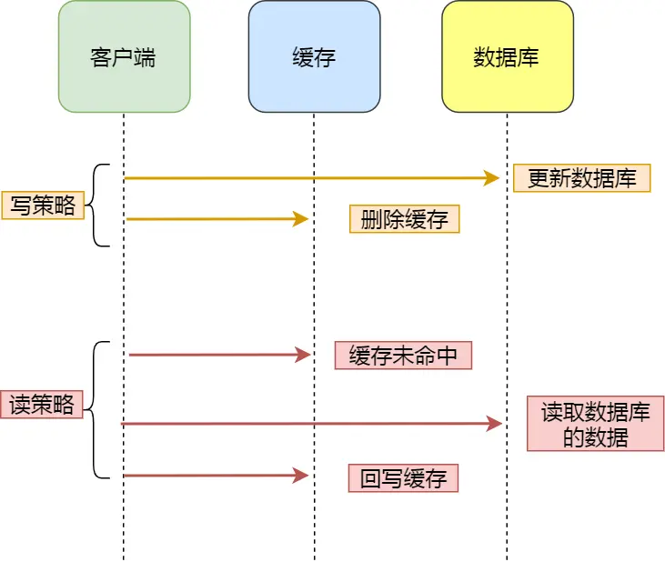

`写策略的步骤：`

- 先更新数据库中的数据，再删除缓存中的数据。

`读策略的步骤：`

- 如果读取的数据命中了缓存，则直接返回数据；
- 如果读取的数据没有命中缓存，则从数据库中读取数据，然后将数据写入到缓存，并且返回给用户。

注意，写策略的步骤的顺序不能倒过来，即`不能先删除缓存再更新数据库`，原因是在「读+写」并发的时候，会出现缓存和数据库的数据不一致性的问题。

举个例子，假设某个用户的年龄是 20，请求 A 要更新用户年龄为 21，所以它会删除缓存中的内容。这时，另一个请求 B 要读取这个用户的年龄，它查询缓存发现未命中后，会从数据库中读取到年龄为 20，并且写入到缓存中，然后请求 A 继续更改数据库，将用户的年龄更新为 21。

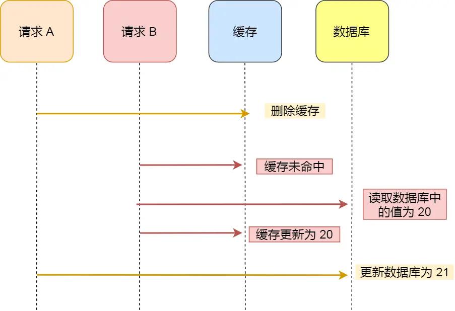

最终，该用户年龄在缓存中是 20（旧值），在数据库中是 21（新值），缓存和数据库的数据不一致。

`为什么「先更新数据库再删除缓存」不会有数据不一致的问题？`

继续用「读 + 写」请求的并发的场景来分析。

假如某个用户数据在缓存中不存在，请求 A 读取数据时从数据库中查询到年龄为 20，在未写入缓存中时另一个请求 B 更新数据。它更新数据库中的年龄为 21，并且清空缓存。这时请求 A 把从数据库中读到的年龄为 20 的数据写入到缓存中。

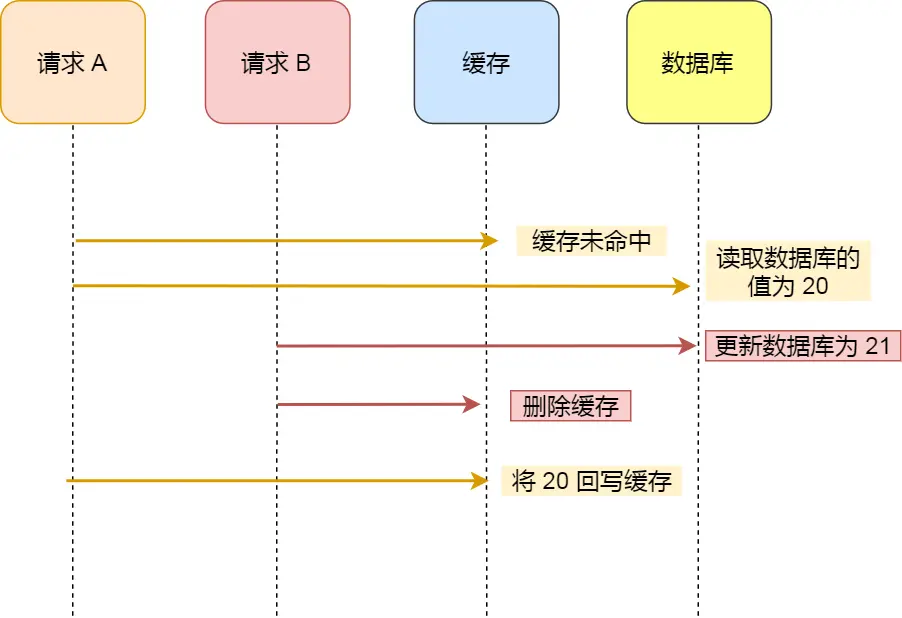

最终，该用户年龄在缓存中是 20（旧值），在数据库中是 21（新值），缓存和数据库数据不一致。 从上面的理论上分析，先更新数据库，再删除缓存也是会出现数据不一致性的问题，`但是在实际中，这个问题出现的概率并不高`。

`因为缓存的写入通常要远远快于数据库的写入，`所以在实际中很难出现请求 B 已经更新了数据库并且删除了缓存，请求 A 才更新完缓存的情况。而一旦请求 A 早于请求 B 删除缓存之前更新了缓存，那么接下来的请求就会因为缓存不命中而从数据库中重新读取数据，所以不会出现这种不一致的情况。

`Cache Aside 策略适合读多写少的场景，不适合写多的场景`，因为当写入比较频繁时，缓存中的数据会被频繁地清理，这样会对缓存的命中率有一些影响。如果业务对缓存命中率有严格的要求，那么可以考虑两种解决方案：

- 一种做法是在更新数据时也更新缓存，只是在更新缓存前先加一个分布式锁，因为这样在同一时间只允许一个线程更新缓存，就不会产生并发问题了。当然这么做对于写入的性能会有一些影响；
- 另一种做法同样也是在更新数据时更新缓存，只是给缓存加一个较短的过期时间，这样即使出现缓存不一致的情况，缓存的数据也会很快过期，对业务的影响也是可以接受。

> Read/Write Through（读穿 / 写穿）策略

Read/Write Through（读穿 / 写穿）策略原则是应用程序只和缓存交互，不再和数据库交互，而是由缓存和数据库交互，相当于更新数据库的操作由缓存自己代理了。

`1、Read Through 策略`

先查询缓存中数据是否存在，如果存在则直接返回，如果不存在，则由缓存组件负责从数据库查询数据，并将结果写入到缓存组件，最后缓存组件将数据返回给应用。

`2、Write Through 策略`

当有数据更新的时候，先查询要写入的数据在缓存中是否已经存在：

- 如果缓存中数据已经存在，则更新缓存中的数据，并且由缓存组件同步更新到数据库中，然后缓存组件告知应用程序更新完成。
- 如果缓存中数据不存在，直接更新数据库，然后返回；

下面是 Read Through/Write Through 策略的示意图：


Read Through/Write Through 策略的特点是由缓存节点而非应用程序来和数据库打交道，在我们开发过程中相比 Cache Aside 策略要少见一些，原因是我们经常使用的分布式缓存组件，无论是 Memcached 还是 Redis 都不提供写入数据库和自动加载数据库中的数据的功能。而我们在使用本地缓存的时候可以考虑使用这种策略。

> Write Back（写回）策略

Write Back（写回）策略在更新数据的时候，只更新缓存，同时将缓存数据设置为脏的，然后立马返回，并不会更新数据库。对于数据库的更新，会通过批量异步更新的方式进行。

实际上，Write Back（写回）策略也不能应用到我们常用的数据库和缓存的场景中，因为 Redis 并没有异步更新数据库的功能。

Write Back 是计算机体系结构中的设计，比如 CPU 的缓存、操作系统中文件系统的缓存都采用了 Write Back（写回）策略。

`Write Back 策略特别适合写多的场景`，因为发生写操作的时候， 只需要更新缓存，就立马返回了。比如，写文件的时候，实际上是写入到文件系统的缓存就返回了，并不会写磁盘。

`但是带来的问题是，数据不是强一致性的，而且会有数据丢失的风险`，因为缓存一般使用内存，而内存是非持久化的，所以一旦缓存机器掉电，就会造成原本缓存中的脏数据丢失。所以你会发现系统在掉电之后，之前写入的文件会有部分丢失，就是因为 Page Cache 还没有来得及刷盘造成的。

这里贴一张 CPU 缓存与内存使用 Write Back 策略的流程图：


## 24. 如何保证缓存和数据库数据的一致性？

[数据库和缓存如何保证一致性](https://xiaolincoding.com/redis/architecture/mysql_redis_consistency.html#%E6%95%B0%E6%8D%AE%E5%BA%93%E5%92%8C%E7%BC%93%E5%AD%98%E5%A6%82%E4%BD%95%E4%BF%9D%E8%AF%81%E4%B8%80%E8%87%B4%E6%80%A7)

## **Redis 实战**
## 25. Redis 如何实现延迟队列？

延迟队列是指把当前要做的事情，往后推迟一段时间再做。延迟队列的常见使用场景有以下几种：

- 在淘宝、京东等购物平台上下单，超过一定时间未付款，订单会自动取消；
- 打车的时候，在规定时间没有车主接单，平台会取消你的单并提醒你暂时没有车主接单；
- 点外卖的时候，如果商家在10分钟还没接单，就会自动取消订单；

在 Redis 可以使用有序集合（ZSet）的方式来实现延迟消息队列的，ZSet 有一个 Score 属性可以用来存储延迟执行的时间。

使用 zadd score1 value1 命令就可以一直往内存中生产消息。再利用 zrangebysocre 查询符合条件的所有待处理的任务， 通过循环执行队列任务即可。


## 26. Redis 的大 key 如何处理？

>什么是 Redis 大 key？

大 key 并不是指 key 的值很大，而是 key 对应的 value 很大。

一般而言，下面这两种情况被称为大 key：

- String 类型的值大于 10 KB；
- Hash、List、Set、ZSet 类型的元素的个数超过 5000个；

> 大 key 会造成什么问题？

大 key 会带来以下四种影响：

- `客户端超时阻塞`。由于 Redis 执行命令是单线程处理，然后在操作大 key 时会比较耗时，那么就会阻塞 Redis，从客户端这一视角看，就是很久很久都没有响应。
- `引发网络阻塞`。每次获取大 key 产生的网络流量较大，如果一个 key 的大小是 1 MB，每秒访问量为 1000，那么每秒会产生 1000MB 的流量，这对于普通千兆网卡的服务器来说是灾难性的。
- `阻塞工作线程`。如果使用 del 删除大 key 时，会阻塞工作线程，这样就没办法处理后续的命令。
- `内存分布不均`。集群模型在 slot 分片均匀情况下，会出现数据和查询倾斜情况，部分有大 key 的 Redis 节点占用内存多，QPS 也会比较大。

> 如何找到大 key ？

### 1、redis-cli --bigkeys 查找大key

可以通过 redis-cli --bigkeys 命令查找大 key：

```shell
redis-cli -h 127.0.0.1 -p6379 -a "password" -- bigkeys
```

使用的时候注意事项：

- 最好选择在从节点上执行该命令。因为主节点上执行时，会阻塞主节点；
- 如果没有从节点，那么可以选择在 Redis 实例业务压力的低峰阶段进行扫描查询，以免影响到实例的正常运行；或者可以使用 -i 参数控制扫描间隔，避免长时间扫描降低 Redis 实例的性能。

该方式的不足之处：

- 这个方法只能返回每种类型中最大的那个 bigkey，无法得到大小排在前 N 位的 bigkey；
- 对于集合类型来说，这个方法只统计集合元素个数的多少，而不是实际占用的内存量。但是，一个集合中的元素个数多，并不一定占用的内存就多。因为，有可能每个元素占用的内存很小，这样的话，即使元素个数有很多，总内存开销也不大；

### 2、使用 SCAN 命令查找大 key

使用 SCAN 命令对数据库扫描，然后用 TYPE 命令获取返回的每一个 key 的类型。

对于 String 类型，可以直接使用 STRLEN 命令获取字符串的长度，也就是占用的内存空间字节数。

对于集合类型来说，有两种方法可以获得它占用的内存大小：

- 如果能够预先从业务层知道集合元素的平均大小，那么，可以使用下面的命令获取集合元素的个数，然后乘以集合元素的平均大小，这样就能获得集合占用的内存大小了。List 类型：LLEN 命令；Hash 类型：HLEN 命令；Set 类型：SCARD 命令；Sorted Set 类型：ZCARD 命令；
- 如果不能提前知道写入集合的元素大小，可以使用 MEMORY USAGE 命令（需要 Redis 4.0 及以上版本），查询一个键值对占用的内存空间。

### 3、使用 RdbTools 工具查找大 key

使用 RdbTools 第三方开源工具，可以用来解析 Redis 快照（RDB）文件，找到其中的大 key。

比如，下面这条命令，将大于 10 kb 的  key  输出到一个表格文件。

```shell
rdb dump.rdb -c memory --bytes 10240 -f redis.csv
```

> 如何删除大 key？

删除操作的本质是要释放键值对占用的内存空间，不要小瞧内存的释放过程。

释放内存只是第一步，为了更加高效地管理内存空间，在应用程序释放内存时，操作系统需要把释放掉的内存块插入一个空闲内存块的链表，以便后续进行管理和再分配。这个过程本身需要一定时间，而且会阻塞当前释放内存的应用程序。

所以，如果一下子释放了大量内存，空闲内存块链表操作时间就会增加，相应地就会造成 Redis 主线程的阻塞，如果主线程发生了阻塞，其他所有请求可能都会超时，超时越来越多，会造成 Redis 连接耗尽，产生各种异常。

因此，删除大 key 这一个动作，我们要小心。具体要怎么做呢？这里给出两种方法：

- 分批次删除
- 异步删除（Redis 4.0版本以上）

#### 1、分批次删除

对于`删除大 Hash`，使用 hscan 命令，每次获取 100 个字段，再用 hdel 命令，每次删除 1 个字段。

Python代码：

```python
def del_large_hash():
  r = redis.StrictRedis(host='redis-host1', port=6379)
    large_hash_key ="xxx" #要删除的大hash键名
    cursor = '0'
    while cursor != 0:
        # 使用 hscan 命令，每次获取 100 个字段
        cursor, data = r.hscan(large_hash_key, cursor=cursor, count=100)
        for item in data.items():
                # 再用 hdel 命令，每次删除1个字段
                r.hdel(large_hash_key, item[0])
```

对于`删除大 List`，通过 ltrim 命令，每次删除少量元素。
Python代码：

```python
def del_large_list():
  r = redis.StrictRedis(host='redis-host1', port=6379)
  large_list_key = 'xxx'  #要删除的大list的键名
  while r.llen(large_list_key)>0:
      #每次只删除最右100个元素
      r.ltrim(large_list_key, 0, -101) 
```

对于`删除大 Set`，使用 sscan 命令，每次扫描集合中 100 个元素，再用 srem 命令每次删除一个键。

Python代码：

```python
def del_large_set():
  r = redis.StrictRedis(host='redis-host1', port=6379)
  large_set_key = 'xxx'   # 要删除的大set的键名
  cursor = '0'
  while cursor != 0:
    # 使用 sscan 命令，每次扫描集合中 100 个元素
    cursor, data = r.sscan(large_set_key, cursor=cursor, count=100)
    for item in data:
      # 再用 srem 命令每次删除一个键
      r.srem(large_size_key, item)
```

对于`删除大 ZSet`，使用 zremrangebyrank 命令，每次删除 top 100个元素。

Python代码：
```python
def del_large_sortedset():
  r = redis.StrictRedis(host='large_sortedset_key', port=6379)
  large_sortedset_key='xxx'
  while r.zcard(large_sortedset_key)>0:
    # 使用 zremrangebyrank 命令，每次删除 top 100个元素
    r.zremrangebyrank(large_sortedset_key,0,99) 
```

#### 2、异步删除

从 Redis 4.0 版本开始，可以采用`异步删除`法，`用 unlink 命令代替 del 来删除`。

这样 Redis 会将这个 key 放入到一个异步线程中进行删除，这样不会阻塞主线程。

除了主动调用 unlink 命令实现异步删除之外，我们还可以通过配置参数，达到某些条件的时候自动进行异步删除。

主要有 4 种场景，默认都是关闭的：

```shell
lazyfree-lazy-eviction no
lazyfree-lazy-expire no
lazyfree-lazy-server-del
noslave-lazy-flush no
```

它们代表的含义如下：

- lazyfree-lazy-eviction：表示当 Redis 运行内存超过 maxmeory 时，是否开启 lazy free 机制删除；
- lazyfree-lazy-expire：表示设置了过期时间的键值，当过期之后是否开启 lazy free 机制删除；
- lazyfree-lazy-server-del：有些指令在处理已存在的键时，会带有一个隐式的 del 键的操作，比如 rename 命令，当目标键已存在，Redis 会先删除目标键，如果这些目标键是一个 big key，就会造成阻塞删除的问题，此配置表示在这种场景中是否开启 lazy free 机制删除；
- slave-lazy-flush：针对 slave (从节点) 进行全量数据同步，slave 在加载 master 的 RDB 文件前，会运行 flushall 来清理自己的数据，它表示此时是否开启 lazy free 机制删除。

建议开启其中的 lazyfree-lazy-eviction、lazyfree-lazy-expire、lazyfree-lazy-server-del 等配置，这样就可以有效的提高主线程的执行效率。

## 27. Redis 管道有什么用？

管道技术（Pipeline）是客户端提供的一种批处理技术，用于一次处理多个 Redis 命令，从而提高整个交互的性能。

普通命令模式，如下图所示：

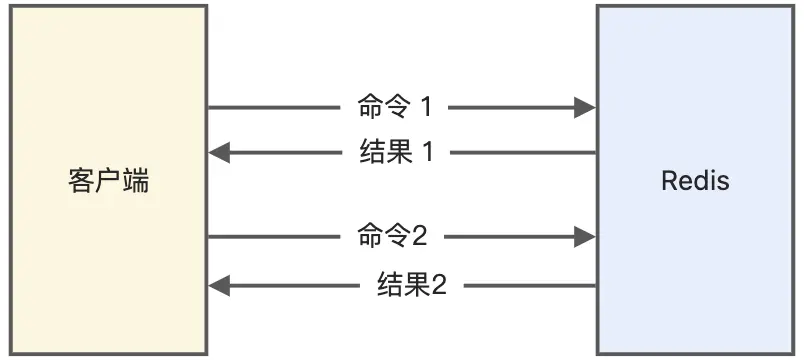

管道模式，如下图所示：

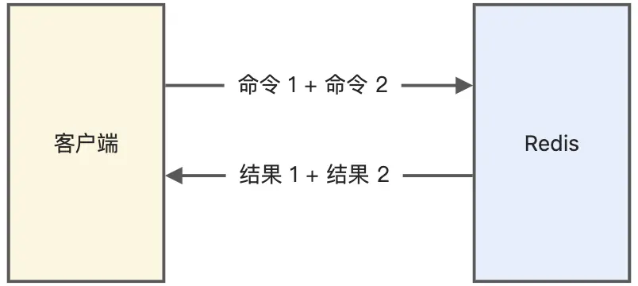

使用`管道技术可以解决多个命令执行时的网络等待`，它是把多个命令整合到一起发送给服务器端处理之后统一返回给客户端，这样就免去了每条命令执行后都要等待的情况，从而有效地提高了程序的执行效率。

但使用管道技术也要注意避免发送的命令过大，或管道内的数据太多而导致的网络阻塞。

要注意的是，管道技术本质上是客户端提供的功能，而非 Redis 服务器端的功能。

## 28. Redis 事务支持回滚吗？

MySQL 在执行事务时，会提供回滚机制，当事务执行发生错误时，事务中的所有操作都会撤销，已经修改的数据也会被恢复到事务执行前的状态。

`Redis 中并没有提供回滚机制`，虽然 Redis 提供了 DISCARD 命令，但是这个命令只能用来主动放弃事务执行，把暂存的命令队列清空，起不到回滚的效果。

下面是 DISCARD 命令用法：

```shell
#读取 count 的值4
127.0.0.1:6379> GET count
"1"
#开启事务
127.0.0.1:6379> MULTI 
OK
#发送事务的第一个操作，对count减1
127.0.0.1:6379> DECR count
QUEUED
#执行DISCARD命令，主动放弃事务
127.0.0.1:6379> DISCARD
OK
#再次读取a:stock的值，值没有被修改
127.0.0.1:6379> GET count
"1"
```

事务执行过程中，如果命令入队时没报错，而事务提交后，实际执行时报错了，正确的命令依然可以正常执行，所以这可以看出 `Redis 并不一定保证原子性`（原子性：事务中的命令要不全部成功，要不全部失败）。

比如下面这个例子：

```shell
#获取name原本的值
127.0.0.1:6379> GET name
"xiaolin"
#开启事务
127.0.0.1:6379> MULTI
OK
#设置新值
127.0.0.1:6379(TX)> SET name xialincoding
QUEUED
#注意，这条命令是错误的
# expire 过期时间正确来说是数字，并不是‘10s’字符串，但是还是入队成功了
127.0.0.1:6379(TX)> EXPIRE name 10s
QUEUED
#提交事务，执行报错
#可以看到 set 执行成功，而 expire 执行错误。
127.0.0.1:6379(TX)> EXEC
1) OK
2) (error) ERR value is not an integer or out of range
#可以看到，name 还是被设置为新值了
127.0.0.1:6379> GET name
"xialincoding"
```

> 为什么Redis 不支持事务回滚？

Redis [官方文档](https://redis.io/topics/transactions/) 的解释如下：

大概的意思是，作者不支持事务回滚的原因有以下两个：

- 他认为 Redis 事务的执行时，错误通常都是编程错误造成的，这种错误通常只会出现在开发环境中，而很少会在实际的生产环境中出现，所以他认为没有必要为 Redis 开发事务回滚功能；
- 不支持事务回滚是因为这种复杂的功能和 Redis 追求的简单高效的设计主旨不符合。

这里不支持事务回滚，指的是不支持事务运行时错误的事务回滚。

## 29. 如何用 Redis 实现分布式锁的？

分布式锁是用于分布式环境下并发控制的一种机制，用于控制某个资源在同一时刻只能被一个应用所使用。

如下图所示：


Redis 本身可以被多个客户端共享访问，正好就是一个共享存储系统，可以用来保存分布式锁，而且 Redis 的读写性能高，可以应对高并发的锁操作场景。

Redis 的 SET 命令有个 NX 参数可以实现「key不存在才插入」，所以可以用它来实现分布式锁：

- 如果 key 不存在，则显示插入成功，可以用来表示加锁成功；
- 如果 key 存在，则会显示插入失败，可以用来表示加锁失败。

基于 Redis 节点实现分布式锁时，对于加锁操作，我们需要满足三个条件。

- 加锁包括了读取锁变量、检查锁变量值和设置锁变量值三个操作，但需要以原子操作的方式完成，所以，我们使用 SET 命令带上 NX 选项来实现加锁；
- 锁变量需要设置过期时间，以免客户端拿到锁后发生异常，导致锁一直无法释放，所以，我们在 SET 命令执行时加上 EX/PX 选项，设置其过期时间；
- 锁变量的值需要能区分来自不同客户端的加锁操作，以免在释放锁时，出现误释放操作，所以，我们使用 SET 命令设置锁变量值时，每个客户端设置的值是一个唯一值，用于标识客户端；

满足这三个条件的分布式命令如下：

```shell
SET lock_key unique_value NX PX 10000 
```

- lock_key 就是 key 键；
- unique_value 是客户端生成的唯一的标识，区分来自不同客户端的锁操作；
- NX 代表只在 lock_key 不存在时，才对 lock_key 进行设置操作；
- PX 10000 表示设置 lock_key 的过期时间为 10s，这是为了避免客户端发生异常而无法释放锁。

而解锁的过程就是将 lock_key 键删除（del lock_key），但不能乱删，要保证执行操作的客户端就是加锁的客户端。所以，解锁的时候，我们要先判断锁的 unique_value 是否为加锁客户端，是的话，才将 lock_key 键删除。

可以看到，解锁是有两个操作，这时就需要 Lua 脚本来保证解锁的原子性，因为 Redis 在执行 Lua 脚本时，可以以原子性的方式执行，保证了锁释放操作的原子性。

```python
// 释放锁时，先比较 unique_value 是否相等，避免锁的误释放
if redis.call("get",KEYS[1]) == ARGV[1] then
    return redis.call("del",KEYS[1])
else
    return 0
end
```

这样一来，就通过使用 SET 命令和 Lua 脚本在 Redis 单节点上完成了分布式锁的加锁和解锁。

基于 Redis 实现分布式锁的`优点`：

1. 性能高效（这是选择缓存实现分布式锁最核心的出发点）。
2. 实现方便。很多研发工程师选择使用 Redis 来实现分布式锁，很大成分上是因为 Redis 提供了 setnx 方法，实现分布式锁很方便。
3. 避免单点故障（因为 Redis 是跨集群部署的，自然就避免了单点故障）。

基于 Redis 实现分布式锁的`缺点`：

- `超时时间不好设置`。如果锁的超时时间设置过长，会影响性能，如果设置的超时时间过短会保护不到共享资源。比如在有些场景中，一个线程 A 获取到了锁之后，由于业务代码执行时间可能比较长，导致超过了锁的超时时间，自动失效，注意 A 线程没执行完，后续线程 B 又意外的持有了锁，意味着可以操作共享资源，那么两个线程之间的共享资源就没办法进行保护了。
    - `那么如何合理设置超时时间呢？` 我们可以基于续约的方式设置超时时间：先给锁设置一个超时时间，然后启动一个守护线程，让守护线程在一段时间后，重新设置这个锁的超时时间。实现方式就是：写一个守护线程，然后去判断锁的情况，当锁快失效的时候，再次进行续约加锁，当主线程执行完成后，销毁续约锁即可，不过这种方式实现起来相对复杂。
- `Redis 主从复制模式中的数据是异步复制的，这样导致分布式锁的不可靠性。`如果在 Redis 主节点获取到锁后，在没有同步到其他节点时，Redis 主节点宕机了，此时新的 Redis 主节点依然可以获取锁，所以多个应用服务就可以同时获取到锁。

> Redis 如何解决集群情况下分布式锁的可靠性？

为了保证集群环境下分布式锁的可靠性，Redis 官方已经设计了一个分布式锁算法 Redlock（红锁）。

它是基于`多个 Redis 节点`的分布式锁，即使有节点发生了故障，锁变量仍然是存在的，客户端还是可以完成锁操作。官方推荐是至少部署 5 个 Redis 节点，而且都是主节点，它们之间没有任何关系，都是一个个孤立的节点。

Redlock 算法的基本思路，`是让客户端和多个独立的 Redis 节点依次请求申请加锁，如果客户端能够和半数以上的节点成功地完成加锁操作，那么我们就认为，客户端成功地获得分布式锁，否则加锁失败。`

这样一来，即使有某个 Redis 节点发生故障，因为锁的数据在其他节点上也有保存，所以客户端仍然可以正常地进行锁操作，锁的数据也不会丢失。

Redlock 算法加锁三个过程：

- 第一步是，客户端获取当前时间（t1）。
- 第二步是，客户端按顺序依次向 N 个 Redis 节点执行加锁操作：
    - 加锁操作使用 SET 命令，带上 NX，EX/PX 选项，以及带上客户端的唯一标识。
    - 如果某个 Redis 节点发生故障了，为了保证在这种情况下，Redlock 算法能够继续运行，我们需要给「加锁操作」设置一个超时时间（不是对「锁」设置超时时间，而是对「加锁操作」设置超时时间），加锁操作的超时时间需要远远地小于锁的过期时间，一般也就是设置为几十毫秒。
- 第三步是，一旦客户端从超过半数（大于等于 N/2+1）的 Redis 节点上成功获取到了锁，就再次获取当前时间（t2），然后计算计算整个加锁过程的总耗时（t2-t1）。如果 t2-t1 < 锁的过期时间，此时，认为客户端加锁成功，否则认为加锁失败。

可以看到，加锁成功要同时满足两个条件（简述：`如果有超过半数的 Redis 节点成功的获取到了锁，并且总耗时没有超过锁的有效时间，那么就是加锁成功`）：

- 条件一：客户端从超过半数（大于等于 N/2+1）的 Redis 节点上成功获取到了锁；
- 条件二：客户端从大多数节点获取锁的总耗时（t2-t1）小于锁设置的过期时间。

加锁成功后，客户端需要重新计算这把锁的有效时间，计算的结果是「锁最初设置的过期时间」减去「客户端从大多数节点获取锁的总耗时（t2-t1）」。如果计算的结果已经来不及完成共享数据的操作了，我们可以释放锁，以免出现还没完成数据操作，锁就过期了的情况。

加锁失败后，客户端向`所有 Redis 节点发起释放锁的操作`，释放锁的操作和在单节点上释放锁的操作一样，只要执行释放锁的 Lua 脚本就可以了。