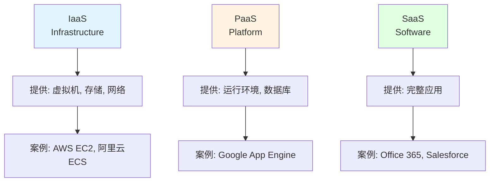

## 📘 IT名词介绍

IT 行业充斥着大量的专业术语、缩写和概念，对于初学者和非技术人员来说常常让人困惑。本专栏收录了常见的 IT 名词、技术术语的解释，帮助你快速理解技术概念。

从云计算到微服务，从 DevOps 到容器化，我们用简单易懂的语言解释复杂的技术概念。

### 🎯 涵盖领域

- ☁️ **云计算**: IaaS、PaaS、SaaS
- 🏗️ **架构模式**: 微服务、SOA、Serverless
- 📦 **容器技术**: Docker、Kubernetes、容器编排
- 🔧 **DevOps**: CI/CD、自动化运维
- 🌐 **网络技术**: CDN、负载均衡、反向代理
- 💾 **数据库**: OLTP、OLAP、NoSQL
- 🔐 **安全术语**: OAuth、JWT、加密算法

---

## 📚 常见IT术语

<CardGrid>
  <Card title="云计算三层" icon="☁️">
    <strong>IaaS</strong>: 基础设施即服务 
    <strong>PaaS</strong>: 平台即服务 
    <strong>SaaS</strong>: 软件即服务
  </Card>
  
  <Card title="架构模式" icon="🏗️">
    <strong>单体架构</strong>: 传统模式 
    <strong>微服务</strong>: 分布式架构 
    <strong>Serverless</strong>: 无服务器
  </Card>
  
  <Card title="数据库类型" icon="💾">
    <strong>RDBMS</strong>: 关系型数据库 
    <strong>NoSQL</strong>: 非关系型 
    <strong>NewSQL</strong>: 新一代SQL
  </Card>
  
  <Card title="DevOps" icon="🔧">
    <strong>CI</strong>: 持续集成 
    <strong>CD</strong>: 持续交付/部署 
    <strong>IaC</strong>: 基础设施即代码
  </Card>
</CardGrid>

---

## 🔤 常用缩写

| 缩写 | 全称 | 中文 | 解释 |
|------|------|------|------|
| **API** | Application Programming Interface | 应用程序接口 | 软件之间的接口规范 |
| **REST** | Representational State Transfer | 表述性状态转移 | 一种API设计风格 |
| **CRUD** | Create, Read, Update, Delete | 增删改查 | 基本数据操作 |
| **ORM** | Object-Relational Mapping | 对象关系映射 | 数据库访问技术 |
| **MVC** | Model-View-Controller | 模型-视图-控制器 | 软件设计模式 |
| **JWT** | JSON Web Token | JSON网络令牌 | 身份认证方案 |
| **CDN** | Content Delivery Network | 内容分发网络 | 网站加速服务 |
| **DNS** | Domain Name System | 域名系统 | 域名和IP转换 |
| **HTTP** | HyperText Transfer Protocol | 超文本传输协议 | Web基础协议 |
| **TCP** | Transmission Control Protocol | 传输控制协议 | 可靠传输协议 |
| **UDP** | User Datagram Protocol | 用户数据报协议 | 快速传输协议 |
| **TLS/SSL** | Transport Layer Security | 传输层安全 | 加密通信协议 |

---

## 🌟 技术概念解析

### 云计算模型

### CAP 定理

- **C** (Consistency): 一致性
- **A** (Availability): 可用性
- **P** (Partition tolerance): 分区容错性

> 💡 **定理**: 分布式系统最多只能满足其中两项

---

## ❓ 常见问题

### Q: 微服务和单体架构有什么区别？
A:

**单体架构**:
- ✅ 开发简单，部署方便
- ❌ 扩展性差，维护困难

**微服务**:
- ✅ 独立部署，技术栈灵活
- ❌ 复杂度高，运维成本大

### Q: Docker 和虚拟机有什么不同？
A:

| 特性 | Docker | 虚拟机 |
|------|--------|--------|
| 启动速度 | 秒级 | 分钟级 |
| 资源占用 | 低 | 高 |
| 隔离性 | 进程级 | 系统级 |
| 性能 | 接近原生 | 有损耗 |

### Q: 什么是 RESTful API？
A:
REST 是一种API设计风格，特点：
- 使用 HTTP 方法（GET/POST/PUT/DELETE）
- 资源用 URL 表示
- 无状态通信
- 统一接口

---

## 💡 学习建议

> **循序渐进**: 从基础概念开始，逐步深入
> 
> **实践验证**: 理论结合实践，动手试试
> 
> **关联学习**: 了解相关技术的联系
> 
> **持续更新**: IT 技术发展快，保持学习

---

## 🔗 学习资源

### 在线资源
- [百度百科](https://baike.baidu.com/) - 基础概念
- [维基百科](https://zh.wikipedia.org/) - 详细解释
- [阮一峰的网络日志](https://www.ruanyifeng.com/blog/) - 技术科普
- [掘金](https://juejin.cn/) - 技术文章

### 推荐阅读
- 《代码大全》- 软件开发基础
- 《凤凰项目》- DevOps 理念
- 《微服务设计》- 架构模式

---

## 📝 分类索引

### A-D
- **API Gateway**: API 网关
- **CI/CD**: 持续集成/持续交付
- **CORS**: 跨域资源共享
- **DDD**: 领域驱动设计

### E-M
- **ELK**: Elasticsearch + Logstash + Kibana
- **gRPC**: 高性能 RPC 框架
- **JWT**: JSON Web Token
- **k8s**: Kubernetes 简称

### N-Z
- **OAuth**: 开放授权标准
- **ORM**: 对象关系映射
- **RPC**: 远程过程调用
- **SPA**: 单页应用
- **WebSocket**: 双向通信协议

---

## 📝 最近更新

<CardGrid>
  <Card title="📊 文档统计" icon="📈">
    本站收录了 <strong>5 篇</strong> IT名词介绍 
    持续扩充中... 
    <small>最后更新: <CustomDateTime /></small>
  </Card>
  
  <Card title="🎯 使用建议" icon="💡">
    <strong>新手</strong>: 从基础概念入手 
    <strong>进阶</strong>: 了解架构和设计模式 
    <strong>专家</strong>: 关注前沿技术
  </Card>
</CardGrid>

 

<Yiyan />