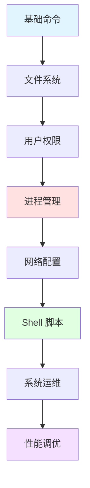

## 📘 Linux 简介

Linux 是一款开源的类 Unix 操作系统内核，由 Linus Torvalds 于 1991 年首次发布。Linux 以其稳定性、安全性、灵活性和强大的社区支持而闻名，是服务器、云计算、嵌入式设备等领域的首选操作系统。

目前，Linux 驱动着全球超过 90% 的云服务器、所有的超级计算机，以及数十亿的嵌入式设备（Android 手机、路由器等）。

### ✨ 核心特性

- 🆓 **开源免费**: GPL 许可，完全开源 
- 🛡️ **稳定可靠**: 长时间运行不重启
- 🔐 **安全性高**: 权限管理严格，漏洞少
- 💪 **高性能**: 资源占用少，效率高
- 🔧 **高度可定制**: 可按需裁剪和配置
- 🌐 **多用户多任务**: 支持并发操作
- 📦 **丰富软件生态**: 海量开源软件

---

## 🚀 快速开始

### Linux 发行版选择

```bash
# 服务器首选
- Ubuntu Server (易用)
- CentOS/AlmaLinux (稳定)
- Debian (纯粹)

# 桌面环境
- Ubuntu Desktop
- Linux Mint
- Fedora

# 精简高级
- Arch Linux
- Gentoo
```

### 常用命令速查

```bash
# 文件操作
ls -la          # 列出文件
cd /path        # 切换目录
pwd             # 当前路径
mkdir dirname   # 创建目录
rm -rf file     # 删除文件/目录
cp src dest     # 复制
mv src dest     # 移动/重命名

# 文本处理
cat file        # 查看文件
grep "text" file    # 搜索文本
less file       # 分页查看
tail -f log     # 实时查看日志

# 系统管理
ps aux          # 查看进程
top / htop      # 系统监控
df -h           # 磁盘使用
free -h         # 内存使用
systemctl status service  # 服务状态

# 网络
netstat -tunlp  # 端口占用
ss -tunlp       # 更快的 netstat
ping host       # 测试连通性
curl url        # 发送 HTTP 请求
```

---

## 📚 文档目录

本站收录的 Linux 相关文档包含 **59 篇**文章，涵盖：

### 🎓 基础知识
- Linux 系统结构
- 文件系统层次
- 用户权限管理
- Shell 基础

### 🔧 系统管理
- 进程管理
- 服务管理 (systemd)
- 软件包管理 (apt/yum)
- 日志管理

### 🌐 网络配置
- 网络配置
- 防火墙 (iptables/firewalld)
- SSH 配置
- Nginx/Apache 部署

### 💼 运维实战
- Shell 脚本编程
- 定时任务 (cron)
- 性能优化
- 故障排查

---

## 🌟 Linux 生态

<CardGrid>
  <Card title="发行版" icon="🐧">
    - Ubuntu/Debian
    - CentOS/RHEL
    - Arch/Manjaro
    - Fedora/openSUSE
  </Card>
  
  <Card title="Shell" icon="💻">
    - Bash (默认)
    - Zsh (强大)
    - Fish (友好)
    - Tmux/Screen
  </Card>
  
  <Card title="服务管理" icon="⚙️">
    - systemd
    - Docker
    - Kubernetes
    - Supervisor
  </Card>
  
  <Card title="监控工具" icon="📊">
    - Prometheus
    - Grafana
    - Zabbix
    - Nagios
  </Card>
</CardGrid>

---

## 🔗 学习资源

### 官方资源
- [Linux Foundation](https://www.linuxfoundation.org/)
- [Kernel.org](https://www.kernel.org/) - 内核源码
- [Ubuntu 文档](https://help.ubuntu.com/)
- [CentOS 文档](https://docs.centos.org/)

### 推荐书籍
- 《鸟哥的 Linux 私房菜》
- 《Linux 命令行与 Shell 脚本编程大全》
- 《深入理解 Linux 内核》
- 《Linux 性能优化实战》

### 在线学习
- [Linux Journey](https://linuxjourney.com/)
- [菜鸟教程 Linux](https://www.runoob.com/linux/)
- [实验楼 Linux](https://www.shiyanlou.com/courses/)

---

## 📊 目录结构

```bash
/                 # 根目录
├── bin/         # 用户二进制文件
├── boot/        # 启动文件
├── dev/         # 设备文件
├── etc/         # 配置文件
├── home/        # 用户主目录
├── lib/         # 系统库文件
├── opt/         # 可选软件
├── proc/        # 进程信息
├── root/        # root 用户主目录
├── sbin/        # 系统二进制文件
├── tmp/         # 临时文件
├── usr/         # 用户程序
└── var/         # 可变文件 (日志等)
```

---

## ❓ 常见问题

### Q: Linux 适合新手吗？
A: 
- **桌面用户**: Ubuntu/Linux Mint 非常友好
- **开发者**: 强烈推荐，命令行效率高
- **运维人员**: 必备技能

### Q: 如何选择 Linux 发行版？
A:
- **服务器**: Ubuntu Server / CentOS
- **桌面**: Ubuntu Desktop / Linux Mint
- **学习**: Arch Linux (进阶)
- **稳定**: Debian

### Q: Linux 和 Windows 有什么区别？
A:
| 特性 | Linux | Windows |
|------|-------|---------|
| 开源 | ✅ | ❌ |
| 免费 | ✅ | ❌ |
| 稳定性 | ⭐⭐⭐⭐⭐ | ⭐⭐⭐⭐ |
| 安全性 | ⭐⭐⭐⭐⭐ | ⭐⭐⭐ |
| 软件生态 | 开源为主 | 商业为主 |
| 服务器占比 | >90% | <10% |

---

## 💡 最佳实践

> **定期更新**: `sudo apt update && sudo apt upgrade`
> 
> **备份重要数据**: 系统升级前必做
> 
> **使用包管理器**: 避免手动编译安装
> 
> **学习 Shell 脚本**: 自动化日常任务
> 
> **掌握日志分析**: `/var/log/` 是排错利器

---

## 📈 学习路线



---

## 🔥 实用技巧

### Bash 快捷键
```bash
Ctrl + C    # 终止当前命令
Ctrl + Z    # 暂停当前命令
Ctrl + A    # 光标到行首
Ctrl + E    # 光标到行尾
Ctrl + R    # 搜索历史命令
Ctrl + L    # 清屏
!!          # 执行上一条命令
!$          # 上一条命令的最后一个参数
```

### 系统优化
```bash
# 查看系统负载
uptime

# 查看内存使用
free -h

# 查看磁盘 I/O
iostat

# 查看网络流量
iftop

# 清理缓存
sync && echo 3 > /proc/sys/vm/drop_caches
```

---

## 📝 最近更新

<CardGrid>
  <Card title="📊 文档统计" icon="📈">
    本站收录了 <strong>59 篇</strong> Linux 相关文档<br/>
    涵盖基础到运维的完整知识<br/>
    <small>最后更新: <CustomDateTime /></small>
  </Card>
  
  <Card title="🎯 学习建议" icon="🎓">
    <strong>入门</strong>: 从 Ubuntu 开始，掌握基础命令<br/>
    <strong>进阶</strong>: Shell 脚本和系统管理<br/>
    <strong>运维</strong>: 服务部署和性能调优
  </Card>
</CardGrid>

<br/>

<Yiyan />
