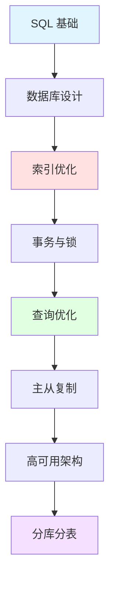

## 📘 MySQL 简介

MySQL 是世界上最流行的开源关系型数据库管理系统（RDBMS），由瑞典 MySQL AB 公司开发，目前属于 Oracle 旗下产品。MySQL 是构建 Web 应用程序的首选数据库，被广泛应用于各种规模的应用中，从个人博客到大型企业系统。

MySQL 以其高性能、高可靠性、易用性而著称，是 LAMP（Linux + Apache + MySQL + PHP）技术栈的重要组成部分。

### ✨ 核心特性

- 🚀 **高性能**: 支持大数据量高并发访问
- 💰 **开源免费**: 社区版完全免费，降低成本
- 🔧 **易于使用**: SQL 语法简单，学习曲线平缓
- 🛡️ **高可靠性**: ACID 事务支持，数据安全有保障
- 📦 **丰富的存储引擎**: InnoDB、MyISAM 等多种选择
- 🌐 **跨平台**: 支持多种操作系统
- 🔌 **广泛支持**: 几乎所有编程语言都有 MySQL 驱动

---

## 🚀 快速开始

### 安装 MySQL

```bash
# macOS (使用 Homebrew)
brew install mysql
brew services start mysql

# Ubuntu/Debian
sudo apt update
sudo apt install mysql-server
sudo systemctl start mysql

# 安全配置
sudo mysql_secure_installation
```

### 连接数据库

```bash
# 命令行连接
mysql -u root -p

# 或使用具体主机
mysql -h localhost -u username -p database_name
```

### 基础SQL操作

```sql
-- 创建数据库
CREATE DATABASE mydb CHARACTER SET utf8mb4 COLLATE utf8mb4_unicode_ci;

-- 使用数据库
USE mydb;

-- 创建表
CREATE TABLE users (
    id INT PRIMARY KEY AUTO_INCREMENT,
    username VARCHAR(50) NOT NULL UNIQUE,
    email VARCHAR(100) NOT NULL,
    created_at TIMESTAMP DEFAULT CURRENT_TIMESTAMP
) ENGINE=InnoDB;

-- 插入数据
INSERT INTO users (username, email) VALUES ('张三', 'zhangsan@example.com');

-- 查询数据
SELECT * FROM users WHERE username = '张三';

-- 更新数据
UPDATE users SET email = 'newemail@example.com' WHERE id = 1;

-- 删除数据
DELETE FROM users WHERE id = 1;
```

---

## 📚 文档目录

本站收录的 MySQL 相关文档包含 **8 篇**文章，涵盖：

### 🎓 基础知识
- SQL 基础语法
- 数据类型详解
- 表的设计与创建
- 索引的使用

### 🔧 进阶主题
- 事务与锁机制
- 查询优化技巧
- 存储引擎对比（InnoDB vs MyISAM）
- 主从复制配置

### 💼 实战应用
- 数据库备份与恢复
- 性能监控与调优
- 高可用架构设计

---

## 🌟 MySQL 生态系统

<CardGrid>
  <Card title="GUI 工具" icon="🖥️">
    - MySQL Workbench（官方）
    - Navicat Premium
    - DBeaver（开源）
    - phpMyAdmin（Web）
  </Card>
  
  <Card title="ORM 框架" icon="🔧">
    - Sequelize（Node.js）
    - SQLAlchemy（Python）
    - GORM（Golang）
    - MyBatis（Java）
  </Card>
  
  <Card title="监控工具" icon="📊">
    - Percona Monitoring
    - MySQL Enterprise Monitor
    - Prometheus + mysqld_exporter
    - Zabbix
  </Card>
  
  <Card title="备份工具" icon="💾">
    - mysqldump（官方）
    - Percona XtraBackup
    - mysqlpump
    - 逻辑备份 vs 物理备份
  </Card>
</CardGrid>

---

## 🔗 学习资源

### 官方资源
- [MySQL 官网](https://www.mysql.com/) - 官方网站
- [MySQL 官方文档](https://dev.mysql.com/doc/) - 完整文档
- [MySQL 8.0 参考手册](https://dev.mysql.com/doc/refman/8.0/en/) - 最新版本
- [MySQL 下载](https://dev.mysql.com/downloads/) - 下载中心

### 推荐书籍
- 《高性能 MySQL》（High Performance MySQL）
- 《MySQL 技术内幕：InnoDB 存储引擎》
- 《MySQL 必知必会》
- 《深入浅出 MySQL》

### 在线学习
- [MySQL 官方教程](https://dev.mysql.com/doc/mysql-tutorial-excerpt/8.0/en/)
- [SQL Zoo](https://sqlzoo.net/) - 在线练习
- [LeetCode 数据库题](https://leetcode.cn/problemset/database/) - 刷题
- [牛客网 SQL 实战](https://www.nowcoder.com/ta/sql)

### 社区资源
- [MySQL 中文网](http://www.mysqlzh.com/)
- [Stack Overflow MySQL 标签](https://stackoverflow.com/questions/tagged/mysql)
- [掘金 MySQL 专栏](https://juejin.cn/tag/MySQL)

---

## 📊 存储引擎对比

| 特性 | InnoDB | MyISAM |
|------|--------|--------|
| **事务支持** | ✅ 支持 | ❌ 不支持 |
| **行级锁** | ✅ 支持 | ❌ 表级锁 |
| **外键** | ✅ 支持 | ❌ 不支持 |
| **崩溃恢复** | ✅ 自动恢复 | ⚠️ 可能损坏 |
| **全文索引** | ✅ 5.6+ | ✅ 支持 |
| **适用场景** | 高并发写入 | 读多写少 |

> 💡 **建议**: 默认使用 InnoDB，除非有特殊需求

---

## ❓ 常见问题

### Q: InnoDB 和 MyISAM 应该选哪个？
A: **强烈推荐 InnoDB**：
- MySQL 5.5+ 默认存储引擎
- 支持事务，保证数据一致性
- 支持行级锁，并发性能更好
- 支持外键约束
- 自动崩溃恢复
- 适合绝大多数场景

### Q: 如何优化 MySQL 查询性能？
A: 
1. **使用索引**: 为常用查询字段建立索引
2. **避免全表扫描**: 使用 WHERE、LIMIT 限制范围
3. **优化 SQL**: 避免 SELECT *，只查询需要的字段
4. **使用 EXPLAIN**: 分析查询执行计划
5. **合理分页**: 避免 OFFSET 过大
6. **读写分离**: 主从复制分担压力

### Q: 如何保证数据安全？
A:
- **定期备份**: mysqldump 或 XtraBackup
- **主从复制**: 数据冗余备份
- **事务机制**: ACID 特性保证一致性
- **权限管理**: 最小权限原则
- **SSL 连接**: 加密数据传输

### Q: MySQL 8.0 有什么新特性？
A:
- 窗口函数（Window Functions）
- 公用表表达式（CTE）
- JSON 增强功能
- 角色管理
- 默认 UTF8MB4
- 性能提升（比 5.7 快 2倍）

---

## 💡 最佳实践

> **使用 UTF8MB4**: 完整支持 Unicode，包括 emoji
> 
> **合理设计索引**: 不要过度索引，平衡查询和写入性能
> 
> **规范命名**: 表名、字段名使用小写+下划线
> 
> **备份策略**: 全备 + 增备，定期测试恢复
> 
> **监控告警**: 实时监控慢查询、连接数、死锁

---

## 📈 学习路线



---

## 🔥 常用命令速查

### 数据库管理
```sql
-- 查看所有数据库
SHOW DATABASES;

-- 创建数据库
CREATE DATABASE dbname;

-- 删除数据库
DROP DATABASE dbname;

-- 查看表结构
DESC table_name;
SHOW CREATE TABLE table_name;
```

### 用户权限
```sql
-- 创建用户
CREATE USER 'username'@'localhost' IDENTIFIED BY 'password';

-- 授权
GRANT ALL PRIVILEGES ON dbname.* TO 'username'@'localhost';

-- 刷新权限
FLUSH PRIVILEGES;

-- 查看权限
SHOW GRANTS FOR 'username'@'localhost';
```

### 性能分析
```sql
-- 查看慢查询
SHOW VARIABLES LIKE 'slow_query%';

-- 分析查询
EXPLAIN SELECT * FROM users WHERE id = 1;

-- 查看进程
SHOW PROCESSLIST;

-- 查看表状态
SHOW TABLE STATUS LIKE 'users';
```

---

## 📝 最近更新

<CardGrid>
  <Card title="📊 文档统计" icon="📈">
    本站收录了 <strong>8 篇</strong> MySQL 相关文档<br/>
    涵盖基础到进阶的完整知识<br/>
    <small>最后更新: <CustomDateTime /></small>
  </Card>
  
  <Card title="🎯 学习重点" icon="🎓">
    <strong>基础</strong>: SQL 语法和数据库设计<br/>
    <strong>进阶</strong>: 索引优化和查询调优<br/>
    <strong>运维</strong>: 主从复制和高可用
  </Card>
</CardGrid>

<br/>

<Yiyan />
