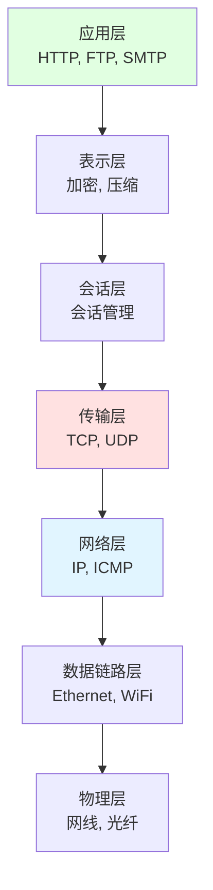
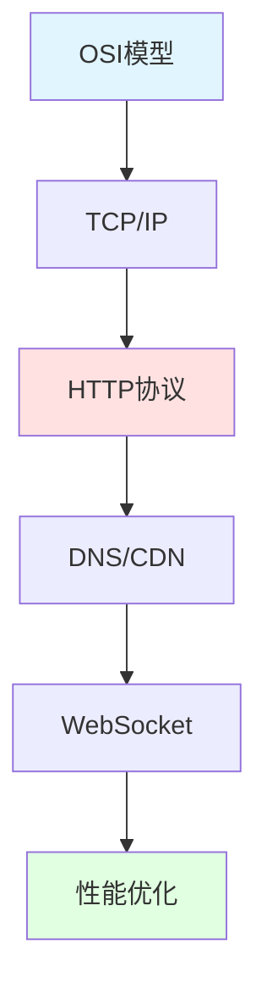

## 📘 网络协议简介

网络协议是计算机网络中数据通信的规则和标准的集合。理解网络协议对于开发网络应用、调试网络问题、优化网络性能至关重要。本专栏收录了常见网络协议的原理、应用和实战技巧。

从 OSI 七层模型到 TCP/IP 四层模型，从 HTTP 到 WebSocket，从 DNS 到 CDN，我们将深入探讨现代互联网的技术基石。

### 📡 核心协议

- 🌐 **HTTP/HTTPS**: Web 通信基础
- 🔐 **TCP/UDP**: 传输层协议
- 📬 **IP**: 网际协议
- 🔍 **DNS**: 域名解析
- 🚀 **HTTP/2, HTTP/3**: 现代 Web 协议
- 🔌 **WebSocket**: 双向通信
- 📧 **SMTP/POP3/IMAP**: 邮件协议

---

## 🚀 快速入门

### OSI 七层模型



### TCP/IP 四层模型

| 层次 | 协议示例 | 功能 |
|------|---------|------|
| **应用层** | HTTP, FTP, DNS | 应用程序接口 |
| **传输层** | TCP, UDP | 端到端通信 |
| **网络层** | IP, ICMP | 路由寻址 |
| **链路层** | Ethernet, WiFi | 物理传输 |

---

## 📚 文档目录

本站收录的网络协议相关文档包含 **6 篇**文章，涵盖：

### 🎓 基础协议
- TCP 三次握手/四次挥手
- UDP 协议特点
- IP 地址与子网划分
- HTTP 请求与响应

### 🔧 应用层协议
- HTTP/HTTPS 详解
- WebSocket 实时通信
- DNS 域名解析
- CDN 内容分发

### 💼 实战应用
- 网络抓包分析 (Wireshark)
- 性能优化技巧
- 常见问题排查

---

## 🌟 协议对比

<CardGrid>
  <Card title="TCP vs UDP" icon="🔄">
    <strong>TCP</strong>: 可靠、有序、慢<br/>
    <strong>UDP</strong>: 快速、无连接、不可靠<br/>
    适用场景各不同
  </Card>
  
  <Card title="HTTP/1.1 vs HTTP/2" icon="🚀">
    <strong>HTTP/2</strong>:<br/>
    - 二进制协议<br/>
    - 多路复用<br/>
    - 头部压缩
  </Card>
  
  <Card title="IPv4 vs IPv6" icon="🌐">
    <strong>IPv6</strong>:<br/>
    - 更大地址空间<br/>
    - 更好安全性<br/>
    - 简化路由
  </Card>
  
  <Card title="抓包工具" icon="🔍">
    - Wireshark<br/>
    - tcpdump<br/>
    - Charles<br/>
    - Fiddler
  </Card>
</CardGrid>

---

## 🔗 学习资源

### 官方规范
- [RFC 文档](https://www.rfc-editor.org/) - 协议标准
- [IETF](https://www.ietf.org/) - 互联网工程任务组
- [W3C](https://www.w3.org/) - Web 标准

### 推荐书籍
- 《计算机网络》- 谢希仁
- 《TCP/IP 详解》- Stevens
- 《图解 HTTP》
- 《Web 性能权威指南》

### 在线工具
- [Ping.pe](https://ping.pe/) - 网络测试
- [DNSChecker](https://dnschecker.org/) - DNS 查询
- [SSL Labs](https://www.ssllabs.com/) - SSL 测试

---

## ❓ 常见问题

### Q: TCP 三次握手为什么不是两次？
A: 
- 防止旧的重复连接请求
- 确认双方收发能力
- 同步序列号

### Q: HTTPS 如何保证安全？
A:
1. **加密**: SSL/TLS 加密数据
2. **认证**: 证书验证服务器身份
3. **完整性**: 防止数据篡改

### Q: DNS 解析过程？
A:
```
浏览器 → 本地DNS → 根DNS服务器 
→ 顶级域DNS → 权威DNS → 返回IP
```

---

## 💡 实用技巧

### 网络调试命令

```bash
# 测试连通性
ping google.com

# 路由跟踪
traceroute google.com
# Windows: tracert google.com

# DNS 查询
nslookup google.com
dig google.com

# 端口扫描
nmap -p 80,443 example.com

# TCP 抓包
tcpdump -i eth0 port 80

# 查看路由表
route -n      # Linux
route print   # Windows
```

---

## 📈 学习路线



---

## 📝 最近更新

<CardGrid>
  <Card title="📊 文档统计" icon="📈">
    本站收录了 <strong>6 篇</strong> 网络协议文档<br/>
    涵盖基础理论到实战应用<br/>
    <small>最后更新: <CustomDateTime /></small>
  </Card>
  
  <Card title="🎯 学习建议" icon="🎓">
    <strong>基础</strong>: OSI 模型和 TCP/IP<br/>
    <strong>进阶</strong>: HTTP/2、WebSocket<br/>
    <strong>实战</strong>: 抓包分析和调优
  </Card>
</CardGrid>

<br/>

<Yiyan />
