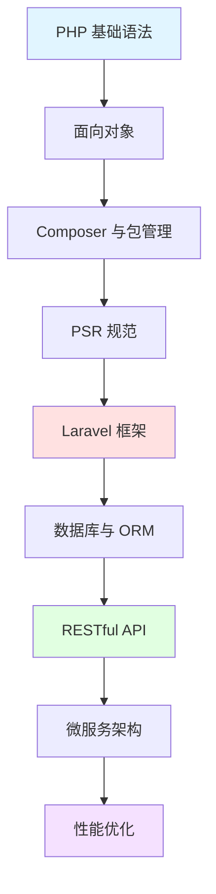

## 📘 PHP 简介

PHP（Hypertext Preprocessor，超文本预处理器）是一种通用开源脚本语言，特别适合 Web 开发。PHP 代码可以嵌入到 HTML 中，也可以与各种 Web 框架、模板系统结合使用。

作为世界上最流行的服务器端脚本语言之一，PHP 驱动着全球超过 **78%** 的网站，包括 Facebook、WordPress、Wikipedia 等知名网站。PHP 8+ 版本带来了显著的性能提升和现代化特性。

### ✨ 核心特性

- 🌐 **Web 原生**: 专为 Web 开发而生，集成度高
- 🚀 **简单易学**: 语法简单，上手快速
- 📦 **生态丰富**: Composer 包管理，海量第三方库
- ⚡ **性能优异**: PHP 8+ JIT 编译器，性能大幅提升
- 💰 **部署成本低**: 主流主机都支持，部署简单
- 🔧 **框架成熟**: Laravel、Symfony、ThinkPHP 等优秀框架
- 🌏 **社区活跃**: 庞大的开发者社区，资源丰富

---

## 🚀 快速开始

### 环境准备

```bash
# macOS (使用 Homebrew)
brew install php

# Ubuntu/Debian
sudo apt install php php-cli php-fpm php-mysql

# 验证安装
php -v
```

### Hello World

```php
<?php
// hello.php
echo "Hello, World!\n";

// 运行
// php hello.php
```

### Web 示例

```php
<?php
// index.php
<!DOCTYPE html>
<html>
<head>
    <title>PHP Demo</title>
</head>
<body>
    <h1><?php echo "Hello from PHP!"; ?></h1>
    <p>当前时间：<?php echo date('Y-m-d H:i:s'); ?></p>
</body>
</html>
```

### Composer 项目创建

```bash
# 安装 Composer
curl -sS https://getcomposer.org/installer | php
sudo mv composer.phar /usr/local/bin/composer

# 创建 Laravel 项目
composer create-project laravel/laravel myapp

# 安装依赖
composer require guzzlehttp/guzzle
```

---

## 📚 文档目录

本站收录的 PHP 相关文档包含 **45 篇**文章，涵盖：

### 🎓 基础知识
- PHP 语法基础
- 数据类型与变量
- 流程控制
- 函数与面向对象
- 命名空间与自动加载

### 🔧 进阶内容
- PSR 规范（PSR-1、PSR-4、PSR-12等）
- Composer 包管理
- 错误与异常处理
- 性能优化
- 安全最佳实践

### 🌐 Web 开发
- HTTP 基础
- Session 与 Cookie
- 文件上传处理
- RESTful API 开发
- 表单验证

### 💾 数据库
- PDO 数据库操作
- ORM 使用（Eloquent）
- 数据库设计
- 查询优化

### 🎯 框架应用
- Laravel 框架
- Symfony 组件
- ThinkPHP
- 微框架（Slim、Lumen）

---

## 🌟 PHP 生态系统

<CardGrid>
  <Card title="Web 框架" icon="🎨">
    - Laravel（最流行）
    - Symfony（企业级）
    - ThinkPHP（国产）
    - CodeIgniter（轻量）
  </Card>
  
  <Card title="CMS 系统" icon="📝">
    - WordPress
    - Drupal
    - Joomla
    - October CMS
  </Card>
  
  <Card title="电商平台" icon="🛒">
    - Magento
    - OpenCart
    - PrestaShop
    - WooCommerce
  </Card>
  
  <Card title="工具库" icon="🔧">
    - Guzzle（HTTP客户端）
    - PHPUnit（单元测试）
    - Carbon（时间处理）
    - Monolog（日志）
  </Card>
</CardGrid>

---

## 🔗 学习资源

### 官方资源
- [PHP 官网](https://www.php.net/) - 官方网站
- [PHP 手册](https://www.php.net/manual/zh/) - 中文文档
- [PHP Fig](https://www.php-fig.org/) - PSR 规范
- [Packagist](https://packagist.org/) - Composer 包仓库

### 框架文档
- [Laravel 中文文档](https://learnku.com/docs/laravel)
- [Symfony 文档](https://symfony.com/doc/)
- [ThinkPHP 文档](https://www.kancloud.cn/manual/thinkphp6_0/)

### 学习网站
- [PHP 中文网](https://www.php.cn/)
- [Laravel China](https://learnku.com/)
- [菜鸟教程 PHP](https://www.runoob.com/php/)
- [W3School PHP](https://www.w3school.com.cn/php/)

### 推荐书籍
- 《Modern PHP》- 现代 PHP 新特性
- 《深入 PHP：面向对象、模式与实践》
- 《PHP 核心技术与最佳实践》

---

## 📊 PHP 版本对比

| 版本 | 发布时间 | 主要特性 | 性能提升 |
|------|---------|---------|---------|
| PHP 7.0 | 2015 | PHPNG 引擎 | 2倍+ |
| PHP 7.4 | 2019 | 类型属性、箭头函数 | 10%+ |
| PHP 8.0 | 2020 | JIT、联合类型、属性 | 15%+ |
| PHP 8.1 | 2021 | 枚举、只读属性 | 5%+ |
| PHP 8.2 | 2022 | 只读类、DNF类型 | 性能优化 |
| PHP 8.3 | 2023 | 类型化常量 | 持续优化 |

> 💡 **建议**: 新项目使用 PHP 8.2+，充分利用现代特性

---

## ❓ 常见问题

### Q: PHP 还值得学习吗？
A: **绝对值得！** PHP 依然是 Web 开发的主流语言：
- 78% 的网站使用 PHP
- Laravel 是最受欢迎的 PHP 框架之一
- PHP 8+ 性能和特性都有巨大提升
- 工作机会多，学习资源丰富

### Q: PHP 8 与 PHP 7 有什么区别？
A: PHP 8 带来重大改进：
- **JIT 编译器**: 性能提升 15%+
- **联合类型**: `function test(int|string $id) {}`
- **命名参数**: `test(name: 'John', age: 30)`
- **属性（Attributes）**: 类似 Java 注解
- **Match 表达式**: 更强大的 switch

### Q: Laravel vs Symfony，该选哪个？
A:
- **Laravel**: 优雅、易学、生态丰富，适合快速开发和中小项目
- **Symfony**: 灵活、企业级、组件化，适合大型复杂项目
- **建议**: 新手从 Laravel 开始，有经验后可学习 Symfony

### Q: PHP 的性能如何？
A: PHP 8+ 的性能已经非常优秀：
- 接近 Java、Go 等编译型语言
- 配合 OpCache 和 JIT，性能提升显著
- 适合高并发 Web 应用

---

## 💡 学习建议

> **掌握基础**: 先学好 PHP 语法、面向对象、命名空间等基础
> 
> **遵循规范**: 学习并遵循 PSR 规范，写出规范的代码
> 
> **框架学习**: 深入学习一个主流框架（推荐 Laravel）
> 
> **实战项目**: 通过实际项目巩固知识，如博客、商城系统
> 
> **关注新特性**: PHP 持续发展，关注最新版本特性

---

## 📈 学习路线



---

## 🔥 热门应用场景

### Web 应用开发
- 企业官网、门户网站
- 电商平台、在线商城
- 内容管理系统（CMS）
- 社交网络平台

### API 服务
- RESTful API
- GraphQL 服务
- 微服务架构
- 第三方集成

### 后台管理
- 管理后台
- 数据统计分析
- 权限管理系统
- 工作流系统

---

## 📝 最近更新

<CardGrid>
  <Card title="📊 文档统计" icon="📈">
    本站收录了 <strong>45 篇</strong> PHP 相关文档<br/>
    涵盖基础到高级的完整知识<br/>
    <small>最后更新: <CustomDateTime /></small>
  </Card>
  
  <Card title="🎯 学习重点" icon="🎓">
    <strong>基础</strong>: PHP 语法和面向对象<br/>
    <strong>框架</strong>: Laravel 或 Symfony<br/>
    <strong>规范</strong>: PSR 编码标准
  </Card>
</CardGrid>

<br/>

<Yiyan />