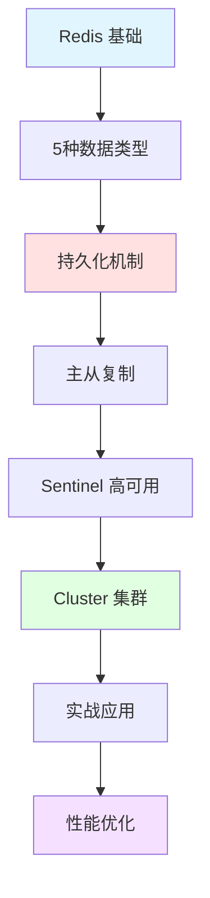

## 📘 Redis 简介

Redis（Remote Dictionary Server）是一个开源的、高性能的键值对（Key-Value）内存数据库，也被称为数据结构服务器。Redis 支持多种数据结构，如字符串、哈希、列表、集合、有序集合等，并提供了丰富的操作命令。

Redis 以其极高的性能（读写速度可达 10万+ QPS）、丰富的数据类型、原子性操作而著称，广泛应用于缓存、会话存储、消息队列、排行榜、实时分析等场景。

### ✨ 核心特性

- ⚡ **极致性能**: 纯内存操作，读写速度极快
- 📦 **丰富数据类型**: String、Hash、List、Set、ZSet等
- 💾 **持久化**: RDB 快照 + AOF 日志
- 🔄 **主从复制**: 支持一主多从架构
- 🎯 **发布订阅**: Pub/Sub 消息模式
- 🔐 **事务支持**: MULTI、EXEC 原子操作
- 🚀 **高可用**: Redis Sentinel 和 Cluster
- 🔧 **Lua 脚本**: 支持服务端脚本执行

---

## 🚀 快速开始

### 安装 Redis

```bash
# macOS (使用 Homebrew)
brew install redis
brew services start redis

# Ubuntu/Debian
sudo apt update
sudo apt install redis-server
sudo systemctl start redis

# Docker 运行
docker run -d -p 6379:6379 --name redis redis:latest
```

### 连接 Redis

```bash
# 命令行客户端
redis-cli

# 带密码连接
redis-cli -h localhost -p 6379 -a yourpassword

# 测试连接
redis-cli ping
# 返回: PONG
```

### 基础操作

```bash
# 字符串操作
SET name "张三"
GET name
INCR counter       # 自增
EXPIRE name 60     # 设置过期时间（秒）

# 哈希操作
HSET user:1 name "张三" age 25
HGET user:1 name
HGETALL user:1

# 列表操作
LPUSH  mylist "a"  # 左侧插入
RPUSH mylist "b"   # 右侧插入
LRANGE mylist 0 -1 # 查看全部

# 集合操作
SADD tags "redis" "database" "cache"
SMEMBERS tags

# 有序集合
ZADD leaderboard 100 "player1" 200 "player2"
ZRANGE leaderboard 0 -1 WITHSCORES
```

---

## 📚 文档目录

本站收录的 Redis 相关文档包含 **10 篇**文章，涵盖：

### 🎓 基础知识
- Redis 数据类型详解
- 常用命令速查
- 持久化机制（RDB vs AOF）
- 内存管理与优化

### 🔧 进阶主题
- Redis 事务与 Lua 脚本
- 发布订阅模式
- 主从复制原理
- 缓存穿透、雪崩、击穿

### 💼 实战应用
- 分布式锁实现
- 限流器设计
- 排行榜系统
- 消息队列应用

---

## 🌟 Redis 应用场景

<CardGrid>
  <Card title="缓存" icon="⚡">
    - 热点数据缓存
    - Session 存储
    - 页面缓存
    - 减轻数据库压力
  </Card>
  
  <Card title="计数器" icon="📊">
    - 文章浏览量
    - 点赞数统计
    - 库存扣减
    - 限流控制
  </Card>
  
  <Card title="排行榜" icon="🏆">
    - 游戏排行
    - 热搜榜单
    - 评分系统
    - 实时统计
  </Card>
  
  <Card title="分布式系统" icon="🔧">
    - 分布式锁
    - 消息队列
    - Session 共享
    - 实时通知
  </Card>
</CardGrid>

---

## 🔗 学习资源

### 官方资源
- [Redis 官网](https://redis.io/) - 官方网站
- [Redis 命令参考](https://redis.io/commands/) - 完整命令文档
- [Redis 中文网](http://www.redis.cn/) - 中文文档
- [Try Redis](https://try.redis.io/) - 在线练习

### 推荐书籍
- 《Redis 设计与实现》- 黄健宏
- 《Redis 实战》（Redis in Action）
- 《Redis 深度历险》- 钱文品
- 《Redis 开发与运维》

### 在线教程
- [Redis 官方教程](https://redis.io/docs/getting-started/)
- [菜鸟教程 Redis](https://www.runoob.com/redis/)
- [Redis 命令速查表](https://redis.io/commands/)

### 社区资源
- [Redis GitHub](https://github.com/redis/redis)
- [Stack Overflow Redis 标签](https://stackoverflow.com/questions/tagged/redis)
- [Redis 中文社区](https://www.redis.net.cn/)

---

## 📊 数据类型对比

| 类型 | 特点 | 常用命令 | 应用场景 |
|------|------|---------|---------|
| **String** | 简单字符串 | SET, GET, INCR | 计数器、缓存 |
| **Hash** | 字段-值对 | HSET, HGET, HGETALL | 对象存储 |
| **List** | 双向链表 | LPUSH, RPUSH, LRANGE | 消息队列 |
| **Set** | 无序集合 | SADD, SMEMBERS, SINTER | 标签、好友 |
| **ZSet** | 有序集合 | ZADD, ZRANGE, ZRANK | 排行榜 |

---

## ❓ 常见问题

### Q: Redis 和 Memcached 有什么区别？
A: 
| 特性 | Redis | Memcached |
|------|-------|-----------|
| 数据类型 | 丰富（5种+） | 仅字符串 |
| 持久化 | 支持 | 不支持 |
| 主从复制 | 支持 | 不原生支持 |
| 事务 | 支持 | 不支持 |
| 性能 | 略低 | 略高 |

**推荐**: 新项目优先考虑 Redis

### Q: 如何解决缓存穿透、雪崩、击穿？
A:

**缓存穿透** (查询不存在的数据):
- 布隆过滤器
- 缓存空值（短期）

**缓存雪崩** (大量缓存同时失效):
- 设置随机过期时间
- 多级缓存
- 熔断降级

**缓存击穿** (热点数据失效):
- 热点数据永不过期
- 互斥锁
- 提前更新

### Q: Redis 持久化选哪个？
A:
- **RDB**: 全量快照，恢复快，但可能丢失数据
- **AOF**: 增量日志，数据完整，但文件大
- **混合**: Redis 4.0+ 推荐，RDB + AOF 结合

### Q: 如何实现分布式锁？
A:
```bash
# 加锁（NX = 不存在才设置，EX = 过期时间）
SET lock:order:123 uuid NX EX 10

# 释放锁（Lua 脚本保证原子性）
if redis.call("get", KEYS[1]) == ARGV[1] then
    return redis.call("del", KEYS[1])
else
    return 0
end
```

---

## 💡 最佳实践

> **合理设置过期时间**: 避免内存溢出
> 
> **使用连接池**: 减少连接开销
> 
> **大key拆分**: 避免单个key过大影响性能
> 
> **慎用 KEYS 命令**: 生产环境使用 SCAN 代替
> 
> **监控内存使用**: 设置 maxmemory 和淘汰策略

---

## 📈 学习路线



---

## 🔥 常用命令速查

### 键操作
```bash
KEYS pattern         # 查找键（慎用）
SCAN cursor          # 迭代键（推荐）
EXISTS key           # 检查键是否存在
DEL key              # 删除键
EXPIRE key seconds   # 设置过期
TTL key              # 查看剩余时间
TYPE key             # 查看类型
```

### 性能监控
```bash
INFO                 # 查看服务器信息
MONITOR              # 实时监控命令
SLOWLOG GET 10       # 查看慢查询
CLIENT LIST          # 查看客户端连接
MEMORY USAGE key     # 查看key内存使用
```

### 持久化
```bash
SAVE                 # 同步保存（阻塞）
BGSAVE               # 后台保存（推荐）
BGREWRITEAOF         # AOF 重写
CONFIG GET save      # 查看RDB配置
```

---

## 🏗️ 架构演进

### 单机 Redis
适合：小型应用、开发环境
```
[Client] --> [Redis]
```

### 主从复制
适合：读多写少场景
```
[Master] --> [Slave1]
         --> [Slave2]
```

### Sentinel 高可用
适合：需要自动故障转移
```
[Sentinel1]   [Sentinel2]   [Sentinel3]
      \            |            /
       [Master] --> [Slave]
```

### Cluster 集群
适合：海量数据、高并发
```
[Cluster Node1] - [Cluster Node2] - [Cluster Node3]
      |                 |                 |
   [Slave1]          [Slave2]          [Slave3]
```

---

## 📝 最近更新

<CardGrid>
  <Card title="📊 文档统计" icon="📈">
    本站收录了 <strong>10 篇</strong> Redis 相关文档<br/>
    涵盖基础到高级的应用知识<br/>
    <small>最后更新: <CustomDateTime /></small>
  </Card>
  
  <Card title="🎯 学习重点" icon="🎓">
    <strong>基础</strong>: 5种数据类型和常用命令<br/>
    <strong>进阶</strong>: 持久化、主从、高可用<br/>
    <strong>实战</strong>: 缓存设计、分布式锁
  </Card>
</CardGrid>

<br/>

<Yiyan />
